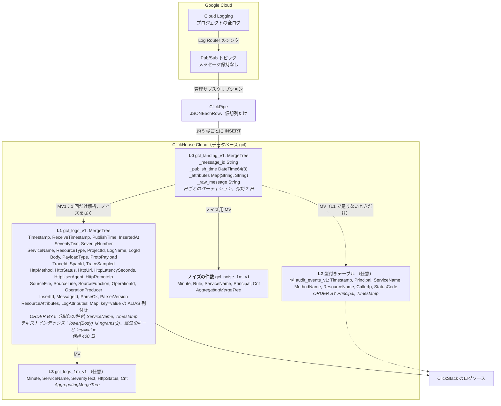

# Google Cloud Logging から ClickHouse Cloud へ

[English](README.md) | 日本語

Google Cloud Logging（以下 Cloud Logging）のログを、Log Router の Pub/Sub シンクと Pub/Sub ClickPipes で ClickHouse Cloud に取り込み、ClickStack で検索・可視化するためのサンプルです。
テーブル設計、Terraform、SQL、検証用の合成ログ、運用手順をまとめています。
取り込んだログは、マテリアライズドビュー（MV）で解析・整形します。

本サンプルの挙動は、実機で確認しています。
検証日、バージョン、条件、測定値は [検証記録](docs/ja/findings.md) にあります。
Pub/Sub ClickPipes は検証時点（2026-10）で Private Preview でした。
挙動は今後変わる可能性があるため、採用前に [ハンズオン](docs/ja/hands-on.md) で同じ確認を利用者の環境で行ってください。

## 構成



| 層 | 必須か | 内容 |
|---|---|---|
| L0 | 必須 | 受信した LogEntry をそのまま保存する。L1・L2 を再構築する際の元データ |
| L1 | 必須 | LogEntry の共通項目（時刻、重大度、ログ名、リソース、トレース、HTTP の主要項目）は列に、個別の内容は属性に保存する。検索、値の取り出し、ダッシュボードはまず L1 で行う |
| L2 | 任意 | ログの種類ごとに作る型付きテーブル。L1 で要件を満たせない場合に作成する |
| L3 | 任意 | 集計テーブル。長期間の推移を見る場合や、集計結果だけを長く保持する場合に作成する |

## ドキュメント

| ドキュメント | 内容 |
|---|---|
| [設計](docs/ja/design.md) | 要点、層の役割、L2 を作る判断、費用の見積もり方、利用者の環境で決めること、設計の詳細 |
| [導入](docs/ja/setup.md) | 始める前の注意、Terraform での構築、作成後の設定の変更、削除 |
| [ハンズオン](docs/ja/hands-on.md) | ローカルの `clickhouse local` だけで SQL を動かす第 1 部、Terraform で実環境に構築して ClickStack で検索する第 2 部、同じものを gcloud と clickhousectl で 1 つずつ作る第 3 部 |
| [運用](docs/ja/operations.md) | 日常の確認、ノイズの除去、L2 と L3、MV のエラーへの対処、避ける操作、保持期間の変更、本番ログへの切り替え、L0・L1 の作り直し（付録） |
| [検証記録](docs/ja/findings.md) | 実機で確かめた挙動と数値 |

## クイックスタート

クラウドのリソースを作らずに、SQL 一式をローカルで確認できます（`clickhouse` と `python3` が必要です）。

```bash
verify/local_e2e.sh 20000
```

L0、L1、L2、L3、ノイズの集計テーブルの件数を照合し、日本語の全文検索の確認結果とともに表で表示します。

実環境に構築する場合は、[導入](docs/ja/setup.md) の手順で Terraform を使います。
先に導入の「始める前に」を読みます。
`terraform apply` を実行した時点から、シンクはプロジェクトの全ログを Pub/Sub へ送り、Pub/Sub の料金がかかります。
まず検証用のプロジェクトで試します。
gcloud と clickhousectl で 1 つずつ作りながら仕組みを確かめる手順は、[ハンズオン](docs/ja/hands-on.md) の第 3 部にあります。

## ディレクトリ

| パス | 内容 |
|---|---|
| `terraform/` | トピック、シンク、IAM、ClickPipes のサービスアカウント、テーブルと MV（`sql/` を実行）、ClickPipe、ClickStack のソースとダッシュボード。`terraform/tests/` に plan だけで動くテスト（`terraform test`、認証情報は不要） |
| `sql/` | L0、L1、MV1、L3（分単位の件数）、ノイズの件数の DDL。`{{VAR}}` は適用時に置き換える |
| `sql/examples/` | 任意の L2 の例（監査ログ、GKE のアップグレード通知） |
| `sql/runbooks/` | 変更の種類ごとの SQL ひな型 |
| `loadgen/gen_logentry.py` | 合成 LogEntry の生成と Pub/Sub への公開（標準ライブラリのみ） |
| `verify/local_e2e.sh` | ローカルの ClickHouse で SQL 一式を通して確認する |
| `verify/completeness.sh` | 公開したメッセージ ID の全件と L0、L1 を突き合わせる |
| `verify/checks.sql` | 遅延、処理が停滞したバッチ、重複、遅延到着、解析の状態などの定期確認 |
| `tools/chq.py` | SQL ファイルを 1 文ずつ `clickhousectl cloud service query` で実行する |

## ライセンス

Apache License 2.0 です。
[LICENSE](LICENSE) を参照してください。

## 対象外

- Cloud Logging の Logs Explorer の機能と ClickStack の機能の対応付け
- 取り込み量に応じたパイプとサービスのサイズの選定（検証記録の負荷試験は小規模です）
- `_Default` バケットのシンクの変更（本番ログへの切り替えは利用者の環境で定めた手順で行います）
