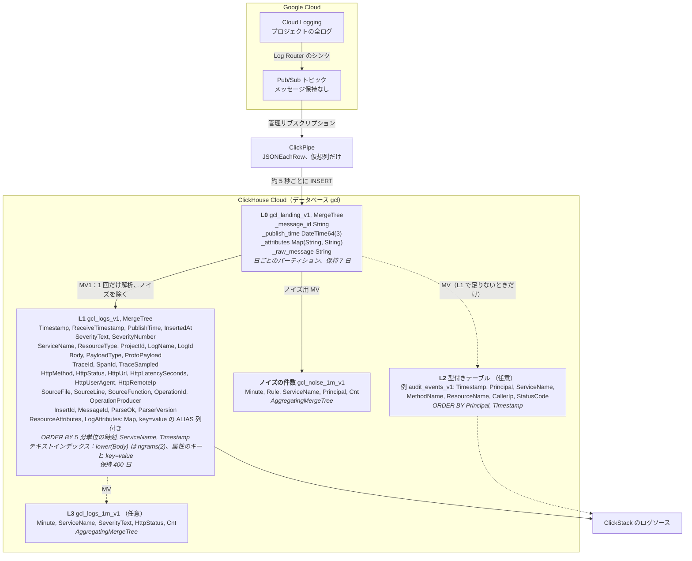

# Google Cloud Logging から ClickHouse Cloud へ

[English](README.md) | 日本語

Google Cloud Logging（以下 Cloud Logging）のログを、Log Router の Pub/Sub シンクと Pub/Sub ClickPipes で ClickHouse Cloud に取り込み、ClickStack で検索・可視化するためのサンプルです。
テーブル設計、Terraform、SQL、検証用の合成ログ、運用の手順をまとめています。

ここに書いた挙動は、実機で確かめた結果です。
検証の日付、版、条件、数値は [検証記録](docs/ja/findings.md) にあります。
Pub/Sub ClickPipes は検証時点（2026-10）で Private Preview でした。
挙動は変わりうるので、採用前に [ハンズオン](docs/ja/hands-on.md) で同じ確認を手元で行ってください。

## 構成



| 層 | 必須か | 中身 |
|---|---|---|
| L0 | 必須 | 届いた LogEntry をそのまま。L1・L2 を作り直すときの元 |
| L1 | 必須 | 封筒（時刻、重大度、ログ名、リソース、トレース、HTTP の主な値）を列に、中身を属性に。検索、値の取り出し、ダッシュボードはまずここ |
| L2 | 任意 | 種類ごとの型付きテーブル。L1 で満たせない要件があるときだけ |
| L3 | 任意 | 集計テーブル。長い期間の推移や、集計だけ長く残すとき |

## 文書

| 文書 | 内容 |
|---|---|
| [設計](docs/ja/design.md) | 要点、層の役割、L2 を作る判断、費用の見積もり方、利用者の環境で決めること、設計の詳細 |
| [導入](docs/ja/setup.md) | Terraform での構築、clickhousectl と gcloud での構築（Terraform を使えない環境）、本番のログへの切り替えの流れ |
| [ハンズオン](docs/ja/hands-on.md) | 手元の `clickhouse local` だけで SQL を動かす第 1 部と、実環境に作って ClickStack で検索する第 2 部 |
| [運用](docs/ja/operations.md) | 日常の確認、ノイズの除去、L2 と L3、MV の故障、使わない操作、L0・L1 の作り直し（付録） |
| [検証記録](docs/ja/findings.md) | 実機で確かめた挙動と数値 |

## すぐ試す

クラウドのリソースを作らずに、SQL 一式を手元で確かめます（`clickhouse` と `python3` が要ります）。

```bash
verify/local_e2e.sh 20000
```

L0 から L1、L2、L3、ノイズの件数までの件数の突き合わせと、日本語の全文検索の結果が表で出ます。

実環境に作るときは、[導入](docs/ja/setup.md) の手順で Terraform を使います。Terraform を使えない環境では `cli/deploy.sh`（gcloud と clickhousectl）で作れます。

```bash
cd terraform
cp terraform.tfvars.example terraform.tfvars   # gcp_project_id と clickhouse_service_id を入れる
terraform init && terraform apply
```

## ディレクトリ

| パス | 内容 |
|---|---|
| `cli/` | Terraform を使えない環境向けに、同じ構成を `gcloud` と `clickhousectl` で作る（`deploy.sh`、`destroy.sh`） |
| `terraform/` | トピック、シンク、IAM、ClickPipes のサービスアカウント、テーブルと MV（`sql/` を流す）、ClickPipe、ClickStack のソースとダッシュボード |
| `sql/` | L0、L1、MV1、L3（分単位の件数）、ノイズの件数の DDL。`{{VAR}}` は適用時に置き換える |
| `sql/examples/` | 任意の L2 の例（監査ログ、GKE のアップグレード通知） |
| `sql/runbooks/` | 変更の種類ごとの SQL ひな型 |
| `loadgen/gen_logentry.py` | 合成 LogEntry の生成と Pub/Sub への公開（標準ライブラリのみ） |
| `verify/local_e2e.sh` | 手元の ClickHouse で SQL 一式を通しで確かめる |
| `verify/completeness.sh` | 公開したメッセージ ID の全件と L0、L1 を突き合わせる |
| `verify/checks.sql` | 遅延、詰まったバッチ、重複、遅延到着、解析の状態などの定期確認 |
| `tools/chq.py` | SQL ファイルを 1 文ずつ `clickhousectl cloud service query` で流す |

## ライセンス

Apache License 2.0 です。[LICENSE](LICENSE) を参照してください。

## 対象外

- Cloud Logging の Logs Explorer の機能と ClickStack の機能の対応付け
- 取り込み量に応じたパイプとサービスのサイズ決め（検証記録の負荷試験は小規模です）
- `_Default` バケットのシンクの変更（本番のログへの切り替えは利用者の環境の手順で行います）
