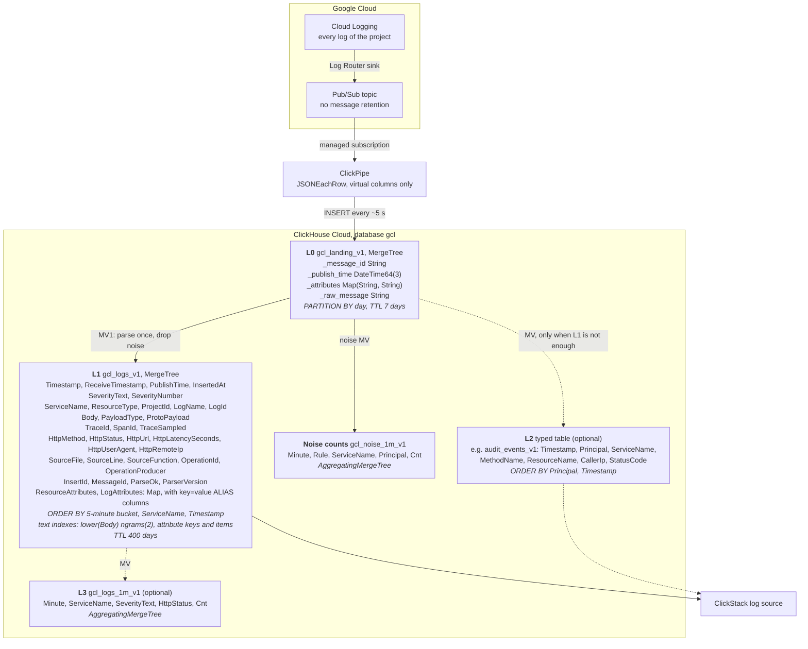

# Google Cloud Logging to ClickHouse Cloud

English | [日本語](README.ja.md)

A sample for ingesting Google Cloud Logging logs into ClickHouse Cloud through a Log Router Pub/Sub sink and Pub/Sub ClickPipes, then searching and visualizing them in ClickStack.
It contains the table design, Terraform, SQL, a synthetic log generator, and operating procedures.
Materialized views (MVs) parse and shape the ingested logs.

The behavior described here was observed on real services.
Dates, versions, conditions, and numbers are in the [findings](docs/en/findings.md).
Pub/Sub ClickPipes was in Private Preview at the time of testing (2026-10).
Behavior may change, so repeat the checks in the [hands-on](docs/en/hands-on.md) before adopting it.

## Architecture



| Layer | Required | Contents |
|---|---|---|
| L0 | Yes | The LogEntry as delivered. Source for rebuilding L1 and L2 |
| L1 | Yes | The envelope (time, severity, log name, resource, trace, main HTTP fields) as columns, the payload as attributes. Start every search, extraction, and dashboard here |
| L2 | No | A typed table for one kind of log. Only when L1 cannot meet a requirement |
| L3 | No | Aggregates, for long-range trends or keeping aggregates longer than rows |

## Documents

| Document | Contents |
|---|---|
| [Design](docs/en/design.md) | Key points, layer roles, when to build an L2, cost estimation, decisions for your environment, design details |
| [Setup](docs/en/setup.md) | Cautions before you start, deploying with Terraform, changing settings, removal |
| [Setup in the browser](docs/en/setup-console.md) | Without Terraform: the same configuration built only in the Google Cloud and ClickHouse Cloud consoles, with screenshots |
| [Hands-on](docs/en/hands-on.md) | Part 1 runs the SQL on a local `clickhouse local`; part 2 deploys to real services with Terraform and searches in ClickStack; part 3 builds the same pieces one at a time with gcloud and clickhousectl |
| [Operations](docs/en/operations.md) | Daily checks, noise rules, L2 and L3, MV failures, operations to avoid, retention, switching production logs, rebuilding L0 and L1 (appendix) |
| [Findings](docs/en/findings.md) | Observed behavior and measurements |

## Quick start

Check the whole SQL set locally without creating any cloud resources (needs `clickhouse` and `python3`).

```bash
verify/local_e2e.sh 20000
```

It prints a table that reconciles row counts across L0, L1, L2, L3, and the noise counts, and compares Japanese full-text search with LIKE.

To deploy to real services, follow [Setup](docs/en/setup.md) and use Terraform.
Read "Before you start" there first: from `terraform apply` on, the sink sends every log of the project to Pub/Sub, which is billed.
Try it in a test project first.
To build the pieces one at a time with gcloud and clickhousectl and see what each does, follow part 3 of the [Hands-on](docs/en/hands-on.md).

## Layout

| Path | Contents |
|---|---|
| `terraform/` | Topic, sink, IAM, ClickPipes service account, tables and MVs (runs `sql/`), ClickPipe, ClickStack source and dashboard. `terraform/tests/` has plan-only tests (`terraform test`, no credentials) |
| `sql/` | DDL for L0, L1, MV1, L3 (per-minute counts) and noise counts. `{{VAR}}` is replaced when applied |
| `sql/examples/` | Optional L2 examples (audit logs, GKE upgrade notifications) |
| `sql/runbooks/` | SQL templates per kind of change |
| `loadgen/gen_logentry.py` | Synthetic LogEntry generator and Pub/Sub publisher (standard library only) |
| `verify/local_e2e.sh` | End-to-end check of the SQL on a local ClickHouse |
| `verify/completeness.sh` | Reconciles every published message ID with L0 and L1 |
| `verify/checks.sql` | Periodic checks: latency, stuck batches, duplicates, late arrivals, parser health |
| `tools/chq.py` | Runs SQL files one statement at a time through `clickhousectl cloud service query` |
| `tools/wait_subscriptions_gone.py` | Waits until ClickPipes has deleted its managed subscription (used by `terraform destroy`) |

## License

Apache License 2.0. See [LICENSE](LICENSE).

## Out of scope

- Mapping Logs Explorer features to ClickStack features
- Sizing pipes and services for a given volume (the load tests in the findings are small)
- Changing the `_Default` bucket sink (moving production logs over follows your own change process)
