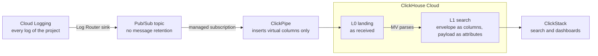
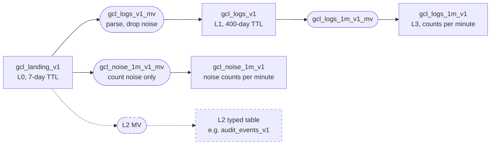
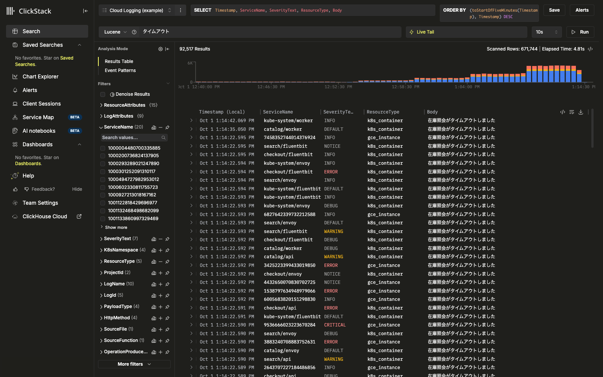
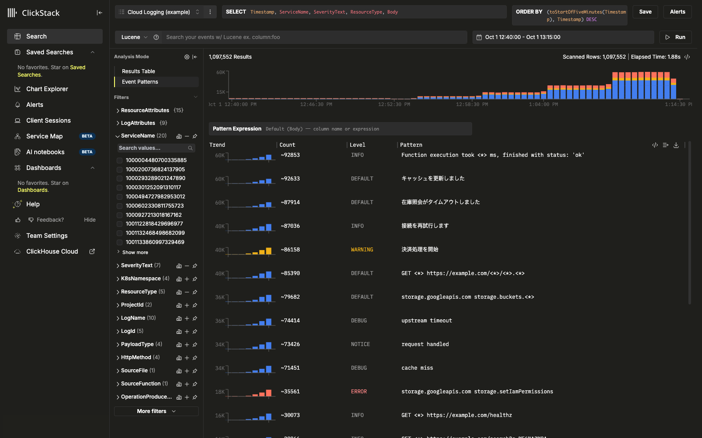
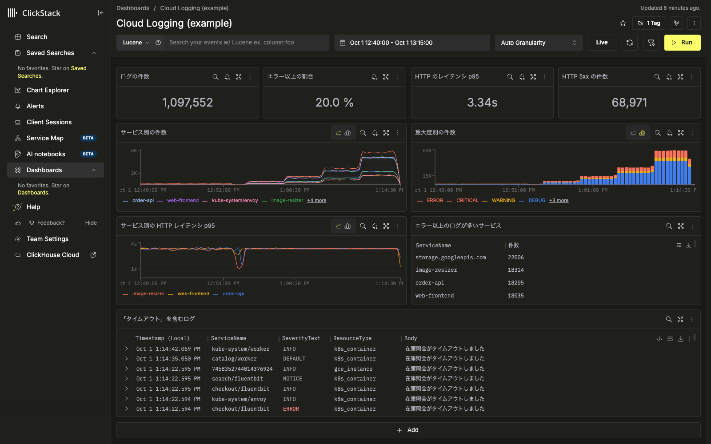

# Design

English | [日本語](../ja/design.md)

This document explains the design decisions for ingesting Google Cloud Logging logs into ClickHouse Cloud with Pub/Sub and ClickPipes, and searching and visualizing them in ClickStack.
The configuration is one example; adjust it to your log types, volumes, and retention requirements.

> The behavior described here was observed on ClickHouse Cloud 26.6 with Pub/Sub ClickPipes (Private Preview).
> Private Preview features may change in behavior and pricing before general availability (GA).
> "(verified)" marks behavior observed on real services, "(docs)" marks statements from official documentation (the link is the source), and "(PoC)" marks items to confirm in your own environment.
> Prices and limits were checked against the official documentation on 2026-10-05.
> Test conditions and numbers are in the [findings](findings.md).

Deployment is in [Setup](setup.md), a guided run is in the [Hands-on](hands-on.md), and procedures are in [Operations](operations.md).

## Key points

- **Architecture**: a Cloud Logging sink sends every log to Pub/Sub, and ClickPipes ingests them into ClickHouse Cloud. Two layers are required: L0 keeps the messages as delivered, and L1 is the table you search.
- **Usage**: every kind of log lands in L1, so search, value extraction, and dashboards start in L1. Typed tables per log kind (L2) and aggregate tables (L3) are added only when L1 cannot meet a requirement.
- **When Cloud Logging costs go down**: sending logs to Pub/Sub does not by itself reduce Cloud Logging costs. Costs drop when you stop storing logs in the `_Default` bucket. Before that, list the features that depend on the logs in `_Default`.
- **New costs**: Pub/Sub throughput, ClickPipes, and ClickHouse Cloud. Pub/Sub charges also apply to logs that Cloud Logging does not bill, so measure while running both paths in parallel.
- **Japanese search**: with a 2-character n-gram full-text index on the body, ClickStack can search Japanese words.
- **Decisions for your environment**: target projects, retention per log kind, who can see what, and what to do with past logs.

## Overview

Boxes are tables, rounded boxes are MVs, dashed ones are optional (built only when L1 cannot meet a requirement).
The L2 MV reads L0, not L1.

| Layer | Required | Contents | Changes during operation | SQL |
|---|---|---|---|---|
| L0 | Yes | The LogEntry as delivered. Source for rebuilding L1 and L2 | None | `sql/10_landing_v1.sql` |
| L1 | Yes | The LogEntry envelope (time, severity, log name, resource, and so on) as columns, the payload as attributes. No assumptions per log kind, so any log fits | Rare | `sql/20_logs_v1.sql`, `sql/30_logs_v1_mv.sql` |
| L2 | No | Typed table for one kind of log | Created or reworked when a requirement appears | examples in `sql/examples/` |
| L3 | No | Aggregates of L1 or L2 | Added when a requirement appears | `sql/40_rollup_1m_v1.sql` |
| Noise counts | No | Per-minute counts of logs kept out of L1 | When a noise rule is added | `sql/50_noise_rollup_v1.sql` |

## Daily use: start with L1

- **Search**: words typed in the ClickStack search box are matched with the full-text index on the body. Attributes such as `audit.principalEmail` are filtered as `key:value`.
- **Extracting values**: values can be extracted from attributes at query time for tables and charts. For example, `extract(LogAttributes['resource'], '/nodePools/([^/]+)')` gives the node pool name and `parseDateTime64BestEffortOrZero(LogAttributes['startTime'])` gives a timestamp.
- **Dashboards**: a table of GKE upgrade notifications (node pool, versions, count, failures, average duration) built from L1 alone returned the same result as the one built from a typed table. (verified)
- The main source maps Service Name to `ServiceName`, Severity to `SeverityText`, Body to `Body`, and attributes to `LogAttributes` and `ResourceAttributes` (`terraform/clickstack.tf`).
- If you build an L2, register it as a separate source.

The screens below use synthetic logs.
The Japanese words in them come from the synthetic messages.

**Searching a Japanese word**: typing 「タイムアウト」 ("timeout") lists the matching logs with a count over time.

**Event Patterns**: groups bodies by shape and sorts them by count. Useful for choosing noise rules.

**Dashboard**: counts, share of ERROR and above, HTTP latency, trends by service and severity, and a list of logs containing a word on one screen (`terraform/clickstack/dashboard.json.tftpl`).

## When to build an L2

An L2 is optional.
Build one only when one of the signals below applies.
Otherwise, search L1 and extract values into tables and charts.

| Signal for an L2 | Try first |
|---|---|
| A screen used daily exceeds its target response time (e.g. a few seconds) on L1 | Narrow the time range. Use an L3 aggregate |
| You often filter on a column (an audit log operator, a node pool) and the L1 sort key cannot skip data for it | Move the value into a column that is in the L1 sort key (such as `ServiceName`) |
| Time or number calculations are heavy or error-prone to write in every query, or are used in alert conditions | Write the expression once in a dashboard tile |
| You need separate retention, access, or deletion rules per log kind | None (an L2 separates them) |
| You need deduplicated results or only the latest state | Use `LIMIT 1 BY` at query time |

- The amount L1 reads is mostly set by the number of rows in the time range. For reference, a table extracted from L1 took 0.16 s for one day (1.1 million rows) and 0.6 s for nine days (18.94 million rows). The same table from a typed table took 13 ms. (verified)
- Do not build an L2 for one-off investigations, low-volume logs, or logs whose payload shape is not stable.
- Add an L3 when long-range trend charts must be fast or when aggregates must be kept longer than rows.

How to build L2 and L3 is in [Operations](operations.md).

## Estimating cost

**Cost items**

| Item | Price (docs) | Volume |
|---|---|---|
| Cloud Logging ingestion (the side that goes down) | $0.50/GiB ([pricing](https://cloud.google.com/stackdriver/pricing); first 50 GiB per project per month free) | Logs no longer stored in `_Default` |
| Pub/Sub publish | $40/TiB ([pricing](https://cloud.google.com/pubsub/pricing)) | Bytes exported by the sink |
| Pub/Sub delivery | $40/TiB (per subscription) | Bytes exported × number of subscriptions |
| ClickPipes (Pub/Sub) | Private Preview ([ClickPipes connectors](https://clickhouse.com/docs/integrations/clickpipes)). Pricing during the preview and after GA is not on the public price list; ask ClickHouse. Other streaming ClickPipes charge $0.04/GB ingested plus replica hours ([pricing](https://clickhouse.com/docs/products/cloud/reference/billing/clickpipes/clickpipes-for-streaming-and-object-storage)) | Ingested volume, number and size of replicas |
| ClickHouse Cloud | Compute and storage on the pricing page | Service size, stored volume (compressed) |

The Pub/Sub free tier is 10 GiB per billing account per month, shared by publish and delivery.

**What to measure while running in parallel**

| Volume | Cloud Monitoring metric |
|---|---|
| Billable Cloud Logging ingestion | `logging.googleapis.com/billing/bytes_ingested` |
| Bytes exported by the sink | `logging.googleapis.com/exports/byte_count` (filter by sink) |
| Pub/Sub publish bytes billed | `pubsub.googleapis.com/topic/byte_cost` |
| Pub/Sub delivery bytes billed | `pubsub.googleapis.com/subscription/byte_cost` |

**Points to watch**

- Pub/Sub charges apply to logs Cloud Logging does not bill. Logs routed to `_Required` (Admin Activity audit logs and others) are free in Cloud Logging, but cost Pub/Sub when a sink exports them. For high-volume ones, consider the noise handling below.
- The JSON a sink exports is larger than the billable Cloud Logging volume. In testing it was about 1.2 times for the log types Cloud Logging bills. Pub/Sub (publish plus delivery) then costs about 20% of Cloud Logging ingestion (1.2 × $40/TiB × 2 ÷ $0.50/GiB).
- The ratio depends heavily on your log mix, so estimate from the metrics above after starting the parallel run.
- On the delivery side, acks and ack deadline extensions were also counted in `byte_cost`. The price list names publish and delivery as billable; check your bill for whether acks and extensions are charged. (PoC)
- A stopped pipe's managed subscription keeps accumulating messages, and messages older than one day incur storage charges. Delete pipes you no longer use. (verified)

## Decisions for your environment

| Setting | Value in this sample | How to decide |
|---|---|---|
| Sink scope | All logs of the project | An aggregated sink for multiple projects |
| Topic message retention | None | Enable briefly only when a pipe swap must seek back |
| Topic storage region | Not restricted | Whether to pin it to the ClickHouse Cloud region |
| ClickPipes replicas | One (smallest size) | Measure volume and latency |
| L0 retention | 7 days | Ingest delay + switch and backfill + reconciliation and rollback, plus margin |
| L1 retention | 400 days | Retention requirements per log kind and privacy rules |
| Body full-text index | `ngrams(2)` | `splitByNonAlpha` if there are no Japanese logs |
| Attribute Map serialization | `with_buckets` for merged parts, default split threshold (32 keys on average) | Measure the average keys per row; lower the threshold only if it is well above 32 and single-key filters are common |
| L2 (typed tables) | None | Only for requirements that match the signals above |
| L3 (aggregates) | Per-minute counts from L1 | Whether you need long-range trends or long-lived aggregates |
| Noise rules | Kubernetes Lease updates, as an example | Find them among the top counts during the parallel run |
| Service replicas | 2 or more, no idle scaling to zero | Search load and availability requirements |
| Alert destinations | ― | L0 to L1 gap, failed inserts, gap against the sink's export count |

Before a PoC, decide the following in your environment.

- Number and layout of target projects (whether to use an aggregated sink)
- Log sources (GKE, Cloud Run, GCE, and so on) and the kinds and volumes of noise to expect
- Whether any logs contain Japanese messages
- Retention per log kind
- Handling of personal data and who can see which logs
- Whether to bring past logs
- Use of Error Reporting, log-based metrics, and log alerts
- Saved queries in Logs Explorer and how people search day to day
- Whether Pub/Sub is inside a VPC Service Controls perimeter
- The ClickHouse Cloud region

## Design details

### Principles

| Principle | Reason |
|---|---|
| The pipe only writes raw messages to L0; parsing happens in MVs | Parsing can change without recreating the pipe. MVs can be replaced online with `MODIFY QUERY` |
| L0 is the replay buffer. Pub/Sub topic retention is not used | L0 is compressed and cheap. Topic retention charges storage on every message and duplicates L0's role |
| Every MV uses `SQL SECURITY DEFINER` | The pipe user needs only INSERT on L0 |
| MVs use only functions that do not throw | A batch that throws never reaches L1, and the pipe eventually stops |
| Boundaries use `_publish_time` (the Pub/Sub publish time) | It always precedes the INSERT, so old and new MVs split the work with no gap or overlap. A LogEntry `timestamp` can be in the past or the future |
| Tables and MVs carry version numbers; never RENAME or EXCHANGE them | Renaming silently stops MVs or keeps them writing to another table |
| Noise is dropped in an MV and only counted, by default | It can be restored from L0 and the trend stays visible. High-volume noise that also stays in Cloud Logging can be excluded at the sink instead |
| L1 fixes only the envelope as columns and takes the payload as attributes, with no assumptions per log kind | You cannot know in advance which logs arrive. The LogEntry envelope is defined by Google; only the payload is free-form |
| Search, extraction, and dashboards start in L1; typed tables are added only for requirements L1 cannot meet | Each extra table adds MVs and operational work. L1 can already produce tables and charts from attributes |

### Cloud Logging

**Sink**

- For one project, set the sink filter to `logName:"projects/<project>/logs/"` to send every log of the project. Narrow by log kind on the ClickHouse side.
- For multiple projects, create an [aggregated sink](https://cloud.google.com/logging/docs/export/aggregated_sinks) on the organization or folder. L1 can filter on `ProjectId`.
- Sinks evaluate logs independently, so adding a Pub/Sub sink does not stop the `_Default` bucket from storing logs. Routing itself is free. (docs: [routing overview](https://cloud.google.com/logging/docs/routing/overview))

**What changes when you stop storing logs in the _Default bucket**

| Feature | After storage stops (docs: [routing overview](https://cloud.google.com/logging/docs/routing/overview), [log-based alerts](https://cloud.google.com/logging/docs/alerting/log-based-alerts)) |
|---|---|
| Error Reporting | Analyzes only logs stored in log buckets, so errors in excluded logs are not reported |
| Logs Explorer and other Cloud Logging search and analytics | Excluded logs cannot be searched |
| System log-based metrics | Count only stored logs, so excluded logs are not counted |
| Log-based metrics defined on the `_Default` bucket | Logs that do not enter the bucket are not counted |
| Project-level user-defined log-based metrics | Keep counting excluded logs; alerts on them keep working |
| Log-match alerts (log-based alerting policies) | Do not operate on excluded logs |

Pricing assumptions (docs: [pricing](https://cloud.google.com/stackdriver/pricing)): ingestion into log buckets is $0.50/GiB including 30 days of storage, and retention beyond 30 days is $0.01/GiB per month.
The `_Required` bucket (Admin Activity audit logs and others) has a fixed 400-day retention at no charge, and its sink cannot be disabled or changed.

**Past logs**

Decide how to handle logs already stored in `_Default` before the switch:

- Keep them in Cloud Logging until they expire and search past data there. Retention charges continue until then.
- Copy them to Cloud Storage and load them into ClickHouse. If the copied LogEntry rows are loaded into L0 in the same shape, MV1's parsing works unchanged. (PoC)

**System of record for audit logs**

The system of record for Admin Activity audit logs stays in the Cloud Logging `_Required` bucket (400 days).
Audit logs that ClickHouse drops from L1 as noise are not lost as evidence.
Treat ClickHouse as a copy for analysis alongside other logs.

### Pub/Sub and ClickPipes

**Topic**

- Do not enable message retention by default. With retention, every published message incurs storage for the retention period ($0.27/GiB per month). (docs: [storage costs](https://cloud.google.com/pubsub/pricing#storage_costs))
- L0 holds the replay data. Retention is needed only when a pipe swap must seek back in time, and even then, creating the new pipe before the boundary time avoids seeking.
- When you must seek, enable a short retention (for example one day) before the work and remove it afterwards. You cannot seek to messages published before retention was enabled.
- Pub/Sub delivers at least once, so a message can arrive twice. Duplicates are identified by `MessageId`.

**ClickPipe**

- Format JSONEachRow, destination the existing L0. Only the virtual columns `_raw_message`, `_message_id`, `_publish_time`, and `_attributes` are mapped.
- The start position can be latest, earliest, or timestamp at creation. (verified)
- "Only destination table" permissions are enough, provided the MVs use `SQL SECURITY DEFINER`. (verified)
- The managed subscription is created automatically in the topic's project as `clickpipes-<pipe id>`, with 7-day retention, a 60 s ack deadline, and ordering enabled ([docs](https://clickhouse.com/docs/integrations/clickpipes/pubsub/overview)). It expires after 31 days of inactivity (the Pub/Sub default expiration), is deleted with the pipe, and is kept when the pipe is only stopped. (verified)
- Unacknowledged messages on the managed subscription incur no storage charge within one day of publishing. If ingestion stops for more than a day, the backlog starts incurring storage. (docs: [storage costs](https://cloud.google.com/pubsub/pricing#storage_costs))
- The pipe inserts about every 5 seconds. Publish to stored took about 3 s at the median and about 5 s at p99. (verified)
- Start with the default single replica (smallest size) and add replicas and size while measuring latency. (docs; values for your volume are PoC)

**Authentication and network**

- ClickPipes takes a service account key file; it is the only supported authentication. Grant the official least-privilege role ([Pub/Sub IAM permissions](https://clickhouse.com/docs/integrations/clickpipes/pubsub/auth)) at the project level (`terraform/gcp.tf`), and assign owners for key storage and rotation.
- The role allows listing topics and creating, consuming and deleting subscriptions anywhere in the project, because ClickPipes also creates short-lived discovery subscriptions (`clickpipes-discovery-<uuid>`) besides the managed one. To narrow it, put the topic in a project dedicated to log export.
- If Pub/Sub is inside a VPC Service Controls perimeter, check whether ClickPipes outside the perimeter can read it. (PoC)
- Place the ClickHouse Cloud service in the same region where the topic stores messages. Crossing regions adds egress charges to delivery. (docs: [pricing](https://cloud.google.com/pubsub/pricing))

### Table definitions

The DDL in `sql/` is the source of truth for columns and settings.
This section groups them by role.

**L0 `gcl_landing_v1`** (`sql/10_landing_v1.sql`)

| Column | Type | Contents |
|---|---|---|
| `_message_id` | String | Pub/Sub message ID |
| `_publish_time` | DateTime64(3) | Pub/Sub publish time; the basis of boundary time T |
| `_attributes` | Map(String, String) | Message attributes |
| `_raw_message` | String | The LogEntry JSON as received |

MergeTree, partitioned by publish date, `ORDER BY _publish_time`, 7-day TTL (`landing_ttl_days`).

**L1 `gcl_logs_v1`** (`sql/20_logs_v1.sql`, parsed by `sql/30_logs_v1_mv.sql`)

| Role | Columns |
|---|---|
| Time | `Timestamp`, `ReceiveTimestamp`, `PublishTime`, `InsertedAt` |
| Severity | `SeverityText`, `SeverityNumber` |
| Source | `ServiceName`, `ResourceType`, `ProjectId`, `LogName`, `LogId` |
| Body | `Body`, `PayloadType`, `ProtoPayload` |
| Trace | `TraceId`, `SpanId`, `TraceSampled` |
| HTTP | `HttpMethod`, `HttpStatus`, `HttpUrl`, `HttpLatencySeconds`, `HttpUserAgent`, `HttpRemoteIp` |
| Code and operation | `SourceFile`, `SourceLine`, `SourceFunction`, `OperationId`, `OperationProducer` |
| IDs and parser state | `InsertId`, `MessageId`, `ParseOk`, `ParserVersion` |
| Attributes | `ResourceAttributes`, `LogAttributes` (Map), `ResourceAttributeItems`, `LogAttributeItems` (`key=value` ALIAS columns) |

| Setting | Value |
|---|---|
| Engine and partitions | MergeTree, by `Timestamp` date |
| Sort key | `(toStartOfFiveMinutes(Timestamp), ServiceName, Timestamp)` (the ClickStack default) |
| Text indexes | `ngrams(2)` on `lower(Body)`; `array` on `TraceId` and on attribute keys and `key=value` items |
| Retention | 400 days (`logs_ttl_days`) |
| Map serialization | `with_buckets` for merged parts only |

**Aggregate tables**

| Table | Reads | Columns | Engine |
|---|---|---|---|
| `gcl_logs_1m_v1` (L3, `sql/40_rollup_1m_v1.sql`) | L1 | `Minute`, `ServiceName`, `SeverityText`, `HttpStatus`, `Cnt` | AggregatingMergeTree |
| `gcl_noise_1m_v1` (noise counts, `sql/50_noise_rollup_v1.sql`) | L0 | `Minute`, `Rule`, `ServiceName`, `Principal`, `Cnt` | AggregatingMergeTree |

L2 examples are in `sql/examples/` (`audit_events_v1` sorted by principal, `gke_upgrades_v1` for GKE upgrade notifications).

### L0: landing table

- Columns are only `_message_id`, `_publish_time`, `_attributes`, and `_raw_message`. MergeTree, partitioned by publish date, with a TTL of 7 days from publishing.
- Size the retention from ingest delay + switch and backfill + reconciliation and rollback, plus margin.
- Redeliveries stay in L0 as separate rows. When rebuilding from L0, add `LIMIT 1 BY _message_id`.
- L0 can use the Null engine, but then everything that relies on L0 stops working: detecting stuck batches, rebuilding after a parser fix, backfilling an L2, and reverting a noise rule. MergeTree is the default.

### L1: parsing and the main table

The MV parses the LogEntry once with `JSONExtract(_raw_message, 'Tuple(...)')` and reads every column from the named tuple.
Compared with one `JSONExtract*` call per field, CPU time was about 1/2.7. (verified)

**Time**

- `Timestamp` is the LogEntry `timestamp`; rows without one use `_publish_time`.
- Cloud Logging accepts timestamps up to 24 hours in the future and back to the bucket's retention ([routing overview](https://cloud.google.com/logging/docs/routing/overview)), so `Timestamp` is not in arrival order. Late logs land in past-date partitions.
- `ReceiveTimestamp` (when Cloud Logging received it) and `PublishTime` (when Pub/Sub published it) are kept too.

**ServiceName**

| Log kind | ServiceName |
|---|---|
| Audit logs (protoPayload is an AuditLog) | API service name (e.g. `compute.googleapis.com`) |
| GKE container logs | namespace/container |
| Cloud Run, Cloud Functions, App Engine | service, function, or module name |
| GCE instance | instance name (instance ID without the label) |
| GKE control plane | `control-plane/`component |
| Anything else | resource type/log id (e.g. `k8s_node/kubelet`) |

**Body**

The first of these that exists:

1. `textPayload`
2. jsonPayload `message`, otherwise `msg`
3. For audit logs (protoPayload is an AuditLog), "service method"
4. With httpRequest, "method status URL" (load balancer logs and similar)
5. The whole jsonPayload JSON
6. For other protoPayloads, "[type name] leading part"
7. Otherwise "[log id]"

Body and ServiceName are always filled, for every kind of log. (verified)

**Attribute naming**

| Map and key | Contents |
|---|---|
| ResourceAttributes keys | LogEntry resource.labels (project_id, cluster_name, namespace_name, ...) and resource.type |
| LogAttributes `labels.*` | LogEntry labels |
| LogAttributes keys without a prefix | Top-level jsonPayload keys. Nested values stay JSON strings |
| LogAttributes `audit.*` | Audit methodName, resourceName, principalEmail, callerIp, userAgent, statusCode (only for AuditLog protoPayloads) |
| LogAttributes `kv.*` | `key="value"` pairs in the body (klog, logfmt). `kv.latency_ms` is latency converted to milliseconds |
| LogAttributes `entry.*` | LogEntry fields without a column (split, errorGroups, apphub, otel, metadata, and fields added later), taken as "everything else" without listing names |
| LogAttributes `http.*`, `operation.*` | httpRequest fields without a column (responseSize, referer, protocol, cacheHit, ...) and operation fields (first, last) |
| LogAttributes `proto.type` | protoPayload type (`@type`) |

- The `key="value"` split applies to every body containing `="`. Unintended keys can appear, so consider limiting it to specific ServiceNames.
- Attributes use the Map type. This follows the ClickStack recommendation; the JSON type is beta in ClickStack and suited to small, stable key sets. (docs: [Map vs JSON](https://clickhouse.com/docs/clickstack/ingesting-data/schema/map-vs-json))
- Applications that keep emitting new jsonPayload keys keep growing LogAttributes. Map serialization is `with_buckets` (stored per key) for merged parts only. Parts averaging under 32 keys per row are not split and keep the same layout as before; only parts with many keys are split, automatically, during merges. (verified)
- Forcing the split makes single-key reads faster but whole-Map reads and inserts slower and storage larger. With 2 to 12 keys on average, single-key queries were 20 to 30% faster and whole-Map queries 2.4 times slower. Do not force it until the average exceeds 32. (verified)
- Keys you filter on often can be promoted to columns.

**Severity and parse state**

- LogEntry severity goes into `SeverityText` as is (DEFAULT when empty), and `SeverityNumber` follows OpenTelemetry (OTel).
- `ParseOk` (whether it was valid JSON) and `ParserVersion` (the parser version) are always set.

**Missing values (no Nullable)**

No column is Nullable.
Missing values become the type's default.
ClickHouse advises avoiding Nullable because it keeps a separate null marker that slows queries, and the ClickStack default schema does not use Nullable either. (verified)

| LogEntry value | String column | Number column | Bool column | Attribute (Map) |
|---|---|---|---|---|
| Field absent | `''` | `0` | `false` | No key |
| `null` | `''` | `0` | `false` | Key present, value `''` |
| Different type (a number as the string `"200"`, ...) | Becomes a string | Becomes a number | `"true"` becomes `false` | Becomes a string |
| Time absent or unreadable | 1970 | ― | ― | ― |

- Columns cannot tell "missing" from 0, empty, or false. When aggregating HTTP values, for example, restrict to HTTP logs with `HttpMethod != ''`.
- `Timestamp` falls back to the publish time, so it is never 1970.
- In attributes, `mapContains(LogAttributes, 'key')` tells whether a key exists. Audit, `entry.*`, and `http.*` attributes never store empty values.
- To use an attribute as a number, convert at query time with `toFloat64OrNull(LogAttributes['key'])` so unconvertible values become NULL.

**Handling noise**

What counts as noise depends on the environment.
During the parallel run, find it with ClickStack Event Patterns or the top counts, and handle it in one of two ways.

| Approach | Suited to | Notes |
|---|---|---|
| Drop it in an MV and keep only counts in a noise table | Rules you may change later; logs that exist only in ClickHouse after `_Default` storage stops | Restorable from L0 within its retention. Pub/Sub and ClickPipes volume does not go down |
| Drop it with an exclusion filter on the Pub/Sub sink (`sink_exclusions` in Terraform) | High-volume logs that also stay in Cloud Logging (such as `_Required`) and that you never search in ClickHouse | Pub/Sub cost goes down too. Counts are no longer visible in ClickHouse |

Example: on GKE, Kubernetes Lease updates (`io.k8s.coordination.v1.leases.update`) are logged as audit entries every few seconds for controller leader election and node heartbeats.
They were the top entries in the test environment, so they were dropped from L1 in the MV and kept only as counts. (verified)
The same condition is written in both MV1 and the noise MV, so changing only one breaks the match.
An L2 also reads L0, so it repeats the condition (`sql/examples/l2_audit_events_v1.sql`).

**Main table and full-text search**

- Column names follow the ClickStack OTel log schema (Timestamp, ServiceName, SeverityText, Body, LogAttributes, ResourceAttributes, ...).
- Partitioned by date; sort key `(toStartOfFiveMinutes(Timestamp), ServiceName, Timestamp)`, the same as the ClickStack default.
- For different retention per log kind (long for audit logs, short for application logs), split tables or use row-level TTL.
- By default one inserted block can touch at most 100 partitions; beyond that the INSERT fails ([max_partitions_per_insert_block](https://clickhouse.com/docs/reference/settings/session-settings/max-partitions)). Where many logs arrive late, monitor ingestion failures.

**Japanese search**

ClickStack turns the words in the search box into `hasAllTokens(lower(Body), lower('word'))` and uses the text index on `lower(Body)`.
Some search paths emit `hasToken` instead.
The 2-character n-gram index was used for both forms on ClickHouse Cloud 26.6, but some versions use it only for `hasAllTokens`.
Check with EXPLAIN on your version (check 7 in `verify/checks.sql`). (verified)

With a word tokenizer (`splitByNonAlpha`), a Japanese sentence becomes a single token.
Searching a Japanese word then returns zero rows without an error.
A 2-character n-gram tokenizer (`ngrams(2)`) finds them.

Example on about 1.1 million synthetic rows (verified):

| lower(Body) tokenizer | Rows for 「タイムアウト」 | Rows for "timeout" | Index size |
|---|---|---|---|
| Words (splitByNonAlpha) | 0 | 70,311 | 3.3 MiB |
| 2-character n-grams (ngrams(2)) | 92,517 | 70,311 | 15.1 MiB |
| Reference: counted with LIKE | 92,517 | 70,311 | ― |

- Where logs contain Japanese, index `lower(Body)` with `ngrams(2)`. English words return the same counts. The index is about 4.5 times the word index.
- An expression can have only one text index, so both tokenizers cannot be used at once.
- One-character words cannot be searched; use SQL LIKE for those.
- A row matches when it contains every 2-character piece, so other orderings match too: a body containing ムアウトタイム also matches タイムアウト. Use LIKE when an exact count matters. (verified)
- Without the index (for example with `use_skip_indexes = 0`), Japanese words did not match and returned 0 rows (clickhouse local 26.7). (verified)
- As in the ClickStack default schema, attributes are indexed on the key list (`mapKeys`) and on `key=value` items (ALIAS columns such as `LogAttributeItems`). With these columns, ClickStack turns attribute filters into `has(LogAttributeItems, 'key=value')` and the index applies. (verified)

### L3: aggregate tables

- Per-minute counts (by ServiceName, severity, and HTTP status) are built from L1 by an MV. Partition operations on L1 (REPLACE/MOVE PARTITION) do not update them, so rebuild the same day.
- Per-minute counts of logs dropped by noise rules (by rule, service, and operator) are built directly from L0.

### L2: typed tables

An L2 is optional.
The examples are in `sql/examples/`:

- `sql/examples/l2_audit_events_v1.sql`: audit logs sorted by operator. It answers the signal "you filter on the operator often and the L1 sort key cannot skip data". Used in the hands-on.
- `sql/examples/l2_gke_upgrades_v1.sql`: GKE upgrade notifications as node pool, state, versions, and start and end time columns.

### Duplicates

- Duplicates are Pub/Sub redeliveries (same `MessageId`) and the same log exported twice (same `InsertId` and `Timestamp`).
- L1 keeps duplicates; only aggregates that must be exact deduplicate by `MessageId` in the query. ClickStack count charts include duplicates.
- Duplicates are rare in normal operation and increase after a pipe pause or failure. Check them with check 3 in `verify/checks.sql`.

### Privacy, access, production, monitoring

**Privacy and access**

- L1 contains personally identifiable values: the operator's email address (`audit.principalEmail`) and caller IP (`audit.callerIp`) in audit logs, and whatever applications write in bodies and jsonPayload.
- Decide who can see what per team or purpose. ClickHouse row policies can split visible rows by `ProjectId` or namespace.
- To hide values, drop or hash them in the MV at ingestion.
- Set query timeouts or quotas for ClickStack users to limit search load.
- Set retention (TTL) in line with your rules for personal data.

**Production**

- Run the service with two or more replicas and disable idle scaling to zero (ingestion never stops).
- Size ClickPipes replicas from measured volume and latency.
- Ingestion and ClickStack search can run on separate compute so they do not interfere; large backfills should also run on compute separate from search. (PoC)
- Backups of long-retention logs can cost as much as storage or more, so set frequency and generations from requirements. Consider excluding what can be reproduced from L0 and the Cloud Logging `_Required` bucket.

**Monitoring**

| What | How | Tells you |
|---|---|---|
| Gap between the sink's export count and ingested rows | Compare Cloud Monitoring `logging.googleapis.com/exports/log_entry_count` (per sink) with L0 rows per publish hour | Loss somewhere on the path. In testing the hourly difference stayed under 0.1% (hour-boundary skew) |
| Rows in L0 but not in L1 | Check 2 in `verify/checks.sql` | Batches stuck by an MV failure |
| Failed inserts | `system.query_log` (check 6) | MV failures, permissions, the partition limit, and so on |
| Ingest latency | p99 from `_publish_time` to stored (check 1) | Not enough pipe capacity |
| Sink export errors | Cloud Monitoring `logging.googleapis.com/exports/error_count` | Sink permission or topic problems |

An MV failure left alone stops the pipe after about 60 minutes.
Alert on the L0 to L1 gap and on failed inserts.
