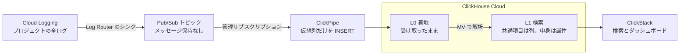
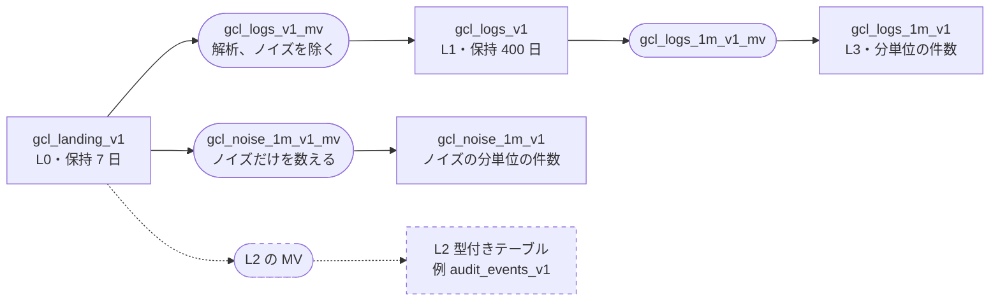

# 設計

[English](../en/design.md) | 日本語

Google Cloud Logging（以下 Cloud Logging）のログを Pub/Sub と ClickPipes で ClickHouse Cloud に取り込み、ClickStack で検索・可視化する構成の設計判断をまとめます。
この構成は一例です。
ログの種類や量、保持要件に合わせて調整します。

> 本書の挙動は ClickHouse Cloud 26.6 と Pub/Sub ClickPipes（Private Preview）で確かめたものです。
> Private Preview の機能は、一般提供（GA）までに挙動や料金が変わることがあります。
> 「（確認済み）」は実機で確かめた挙動、「（公式資料）」は公式の資料による記述（リンク先が出典）、「（PoC で確認）」は利用者の環境で確かめる項目を表します。
> 料金と仕様は 2026-10-05 に公式資料で確かめた値です。
> 測定の条件と数値は [検証記録](findings.md) にあります。

導入の手順は [導入](setup.md)、手元と実環境で動かす手順は [ハンズオン](hands-on.md)、運用の手順は [運用](operations.md) にあります。

## 要点

- **構成**：Cloud Logging のシンクで全ログを Pub/Sub に送り、ClickPipes で ClickHouse Cloud に取り込みます。届いたログをそのまま残す L0 と、検索用の L1 の 2 層が必須です。
- **使い方**：ログの種類を問わず L1 に格納できるため、検索、値の取り出し、ダッシュボードはまず L1 で行います。種類ごとの型付きテーブル（L2）や集計テーブル（L3）は、L1 で要件を満たせない場合にのみ追加します。
- **費用が下がる条件**：Pub/Sub に送り始めただけでは、Cloud Logging の費用は下がりません。下がるのは `_Default` バケットへの保存を止めたときで、止める前に `_Default` のログを利用する機能を洗い出します。
- **新たにかかる費用**：Pub/Sub の転送料、ClickPipes、ClickHouse Cloud です。Pub/Sub の転送料は Cloud Logging が課金しないログにもかかるので、並走中に実測して見積もります。
- **日本語の検索**：本文の全文検索インデックスを 2 文字ずつの区切りにすれば、ClickStack で日本語の語を検索できます。
- **利用者側で決めること**：対象のプロジェクト、ログの種類ごとの保持期間、閲覧できる人の範囲、過去のログの扱いなどです。

## 全体像

四角はテーブル、丸い箱は MV、点線は任意（L1 で要件を満たせないときだけ作る）です。
L2 の MV は L1 ではなく L0 を読みます。

| 層 | 必須か | 内容 | 運用での変更 | SQL |
|---|---|---|---|---|
| L0 | 必須 | 受信した LogEntry をそのまま保存する。L1・L2 を再構築する際の元データ | ない | `sql/10_landing_v1.sql` |
| L1 | 必須 | LogEntry の共通項目（時刻、重大度、ログ名、リソースなど）は列に、個別の内容は属性に保存する。特定のログ形式を前提にせず、ログの種類を問わず格納できる | ほとんどない | `sql/20_logs_v1.sql`、`sql/30_logs_v1_mv.sql` |
| L2 | 任意 | 特定の種類のログの型付きテーブル | 要件があるときに作る・作り替える | 例 `sql/examples/` |
| L3 | 任意 | L1 や L2 の集計 | 要件がある場合に追加する | `sql/40_rollup_1m_v1.sql` |
| ノイズの件数 | 任意 | L1 から外したログの分単位の件数 | ノイズの除外条件を追加する場合 | `sql/50_noise_rollup_v1.sql` |

## 日々の使い方：まず L1 で

- **検索**：ClickStack の検索窓に語を入れると、本文の全文検索インデックスを使って検索します。属性（`audit.principalEmail` など）は「キー:値」で絞り込めます。
- **値の取り出し**：属性から検索時に値を取り出して、表やグラフにできます。例えば `extract(LogAttributes['resource'], '/nodePools/([^/]+)')` でノードプール名を、`parseDateTime64BestEffortOrZero(LogAttributes['startTime'])` で時刻を取り出します。
- **ダッシュボード**：GKE のアップグレード通知の表（ノードプール、版、件数、失敗、平均時間）を L1 だけで作ると、型付きテーブルで作った表と同じ結果になりました。（確認済み）
- L1 のログソースは、Service Name に `ServiceName`、Severity に `SeverityText`、Body に `Body`、属性に `LogAttributes` と `ResourceAttributes` を割り当てます（`terraform/clickstack.tf`）。
- L2 を作った場合は、別のソースとして登録します。

次の画面は合成ログによる例です。

**日本語の語での検索**：検索窓に「タイムアウト」と入れると、本文にその語を含むログが一覧と件数の推移として表示されます。

**パターン抽出（Event Patterns）**：本文を似た形ごとにまとめ、件数の多い順に並べます。ノイズの除外条件を決めるときにも使います。

**ダッシュボード**：件数、エラー以上の割合、HTTP のレイテンシ、サービス別・重大度別の推移、特定の語を含むログの一覧を 1 画面に並べた例です（`terraform/clickstack/dashboard.json.tftpl`）。

## L2 を作るかどうかの判断

L2 は任意です。
次の条件のいずれかに該当する場合にのみ作成します。
どれにも該当しなければ、L1 で検索し、値を取り出して表やグラフにします。

| L2 を作る判断基準 | L2 の前に試すこと |
|---|---|
| 日常的に使う画面で、L1 での応答が目標時間（例：数秒）を超える | 対象期間を短くする。L3 の集計を使う |
| 特定の列（監査ログの操作者、ノードプールなど）で頻繁に絞るのに、L1 の並び順では読み取り量が減らない | その値を、L1 の並び順に含まれる列（ServiceName など）で表現できるか検討する |
| 時刻や数値の計算を毎回の検索で記述する負担が大きい、または間違えやすい。アラートの条件に使う | ダッシュボードのタイルに式を一度だけ書く |
| 保持期間、閲覧権限、削除の扱いを種類ごとに分けたい | なし（L2 で分ける） |
| 重複を除いた結果や、最新の状態だけが欲しい | 検索時に `LIMIT 1 BY` を使う |

- L1 の読み取り量は、対象期間の行数でほぼ決まります。参考までに、L1 から取り出す表は、1 日分（110 万行）が 0.16 秒、9 日分（1,894 万行）が 0.6 秒でした。同じ表を型付きテーブルから作ると 13 ms でした。（確認済み）
- 一度きりの調査、量の少ないログ、内容の形式が安定していないログには、L2 を作りません。
- L3 は、長期間の推移を示すグラフを高速化したい場合や、個々のログより集計結果を長く保持したい場合に追加します。

L2 と L3 の作り方は [運用](operations.md) にあります。

## 費用の見積もり方

**料金の要素**

| 要素 | 料金（公式資料） | 課金対象 |
|---|---|---|
| Cloud Logging の取り込み（削減対象） | $0.50/GiB（[料金](https://cloud.google.com/stackdriver/pricing)。プロジェクトごとに毎月 50 GiB まで無料） | `_Default` に入れなくなるログの量 |
| Pub/Sub の公開 | $40/TiB（[料金](https://cloud.google.com/pubsub/pricing)） | シンクの送出量 |
| Pub/Sub の配信 | $40/TiB（サブスクリプションごと） | シンクの送出量 × サブスクリプションの数 |
| ClickPipes（Pub/Sub） | Private Preview（[ClickPipes の一覧](https://clickhouse.com/docs/integrations/clickpipes)）。Preview 中と GA 後の料金は公開の料金表になく、ClickHouse に確認する。他のストリーミング ClickPipes は、取り込み $0.04/GB とレプリカの時間料金（[料金](https://clickhouse.com/docs/products/cloud/reference/billing/clickpipes/clickpipes-for-streaming-and-object-storage)） | 取り込み量、レプリカ数とサイズ |
| ClickHouse Cloud | 料金ページのコンピュートとストレージ | サービスのサイズ、保存量（圧縮後） |

Pub/Sub の無料枠は、公開と配信を合わせて請求先アカウントごとに毎月 10 GiB です。

**並走中に測るもの**

| 量 | Cloud Monitoring の指標 |
|---|---|
| Cloud Logging の課金対象の取り込み量 | `logging.googleapis.com/billing/bytes_ingested` |
| シンクの送出量 | `logging.googleapis.com/exports/byte_count`（シンクで絞る） |
| Pub/Sub の公開の計上量 | `pubsub.googleapis.com/topic/byte_cost` |
| Pub/Sub の配信の計上量 | `pubsub.googleapis.com/subscription/byte_cost` |

**見積もりで気をつける点**

- Pub/Sub の転送料は、Cloud Logging が課金しないログにもかかります。`_Required` 行きのログ（Admin Activity の監査ログなど）は、Cloud Logging では無料でも、シンクで送れば Pub/Sub の料金がかかります。量の多いものは、後述のノイズの対処を検討します。
- シンクが送る JSON は、Cloud Logging の課金対象の量より大きくなります。検証では、Cloud Logging が課金する種類のログで約 1.2 倍でした。この場合、Pub/Sub（公開と配信）の料金は Cloud Logging の取り込み料の約 2 割になります（1.2 × $40/TiB × 2 ÷ $0.50/GiB）。
- ログの構成で比率は大きく変わるので、並走を始めてから上の指標で実測して見積もります。
- 配信側では、ack と ack 期限の延長も `byte_cost` に計上されました。料金表が課金対象として挙げるのは公開と配信で、ack と期限の延長が課金されるかは請求の内訳で確かめます。（PoC で確認）
- 停止したパイプの管理サブスクリプションにはメッセージが蓄積し続け、公開から 1 日を超えた分に保管料がかかります。使わなくなったパイプは削除します。（確認済み）

## 利用者の環境で決めること

| 設定項目 | 本書の値 | 決め方 |
|---|---|---|
| シンクの範囲 | プロジェクトの全ログ | 複数のプロジェクトなら集約シンク |
| トピックのメッセージ保持 | なし | パイプの差し替えで遡るときだけ、短く有効にする |
| トピックの保存リージョン | 指定なし | ClickHouse Cloud と同じリージョンに固定するかを決める |
| ClickPipes のレプリカ | 1 つ（最小サイズ） | 取り込み量と遅延を測って決める |
| L0 の保持日数 | 7 日 | 取り込みの遅延、切り替えとバックフィル、照合とロールバックに必要な期間に余裕を加える |
| L1 の保持日数 | 400 日 | ログの種類ごとの保持要件と、個人情報の規程 |
| 本文の全文検索インデックス | `ngrams(2)` | 日本語のログがなければ `splitByNonAlpha` |
| 属性の Map の保存形式 | マージ後は `with_buckets`、分割の下限は既定（平均 32 キー） | 1 行あたりのキーの平均を測り、32 個を大きく超えて 1 つのキーでの絞り込みが多ければ下限を下げる |
| L2（型付きテーブル） | なし | 前述の判断基準に該当する要件があるときだけ作る |
| L3（集計） | 分単位の件数（L1 から） | 長い期間の推移を見るか、集計だけを長く残すか |
| ノイズの除外条件 | 例として Kubernetes の Lease の更新 | 並走中に件数の上位から見つける |
| サービスのレプリカ | 2 以上、アイドル停止なし | 検索の負荷と可用性の要件 |
| 監視の通知先 | ― | L0 と L1 の差、失敗した INSERT、シンクとの件数の差 |

PoC の前に、次のことを利用者の環境で決めておきます。

- 対象のプロジェクトの数と構成（集約シンクにするか）
- ログの発生源（GKE、Cloud Run、GCE など）と、そこから見込まれるノイズの種類と量
- 日本語のメッセージを出すログの有無
- ログの種類ごとの保持期間
- 個人情報の扱いと、閲覧できる人の範囲
- 過去のログを ClickHouse に移行するか
- Error Reporting、ログベース指標、ログのアラートの利用状況
- Logs Explorer の保存済みクエリや、日常の検索の使い方
- Pub/Sub を VPC Service Controls の境界の中に置いているか
- ClickHouse Cloud のリージョン

## 設計の詳細

### 設計の原則

| 原則 | 理由 |
|---|---|
| パイプは生メッセージを L0 に書くだけにし、解析は MV で行う | 解析を変えてもパイプを作り直さずに済む。MV は `MODIFY QUERY` で無停止に差し替えられる |
| 再処理に使う元データは L0 に保存する。Pub/Sub トピックの保持は使わない | L0 は圧縮されるので安い。トピックの保持は全メッセージに保管料がかかり、L0 と役割が重なる |
| MV はすべて `SQL SECURITY DEFINER` で作る | パイプのユーザーが L0 への INSERT 権限だけで済む |
| MV の中では例外を出さない関数だけを使う | 例外が出たバッチは L1 に届かず、放置するとパイプが止まる |
| 境界時刻は `_publish_time`（Pub/Sub の公開時刻）に置く | INSERT より必ず前の時刻なので、新旧の MV の分担に隙間も重なりもできない。LogEntry の timestamp は過去や未来の値を取りうる |
| テーブルと MV は版番号付きの名前にし、RENAME も EXCHANGE も使わない | 名前の付け替えで、MV がエラーを出さずに実行されなくなったり、別のテーブルに書き続けたりする |
| ノイズは MV で除外し、件数だけを残すことを基本とする | L0 から復元でき、件数の推移も確認できる。Cloud Logging 側にも残る大量のノイズは、シンクで除外する選択肢もある |
| L1 は共通項目を列として定義し、個別の内容を属性として保存する。特定のログ形式を前提にしない | ログの種類は事前に特定できない。LogEntry の共通項目は Google が定義しているが、ペイロードの内容はログの種類によって異なる |
| 検索、値の取り出し、ダッシュボードはまず L1 で行う。型付きテーブルは L1 で要件を満たせない場合にのみ追加する | テーブルを増やすほど MV と運用の手間が増える。L1 でも属性から値を取り出して表やグラフを作れる |

### Cloud Logging 側

**シンク**

- 1 プロジェクトなら、シンクのフィルタを `logName:"projects/<project>/logs/"` にしてプロジェクトの全ログを送ります。種類の絞り込みは ClickHouse 側で行います。
- 複数のプロジェクトをまとめるなら、組織またはフォルダに集約シンク（[aggregated sink](https://cloud.google.com/logging/docs/export/aggregated_sinks)）を作ります。L1 では `ProjectId` で絞り込めます。
- シンクはそれぞれ独立にログを評価するので、Pub/Sub へのシンクを追加しても、既存の `_Default` バケットへの保存はそのまま続きます。Log Router の転送そのものに料金はかかりません。（公式資料：[ルーティングの概要](https://cloud.google.com/logging/docs/routing/overview)）

**_Default バケットへの保存を止めると変わるもの**

| 機能 | 保存を止めた後（公式資料：[ルーティングの概要](https://cloud.google.com/logging/docs/routing/overview)、[ログベースのアラート](https://cloud.google.com/logging/docs/alerting/log-based-alerts)） |
|---|---|
| Error Reporting | ログバケットに保存されたログしか解析しないので、止めたログのエラーは集計されない |
| ログエクスプローラなど Cloud Logging の検索と分析の機能 | 止めたログは検索できない |
| システムのログベース指標 | 保存されたログだけを数えるので、止めたログは数えられない |
| `_Default` バケットに定義したログベース指標 | バケットに入らないログは数えられない |
| プロジェクト単位のユーザー定義のログベース指標 | 除外したログも数え続ける。この指標に付けたアラートも動く |
| ログの一致を条件にしたアラート（ログベースのアラート） | 除外したログには動かない |

料金の前提（公式資料：[料金](https://cloud.google.com/stackdriver/pricing)）：ログバケットへの取り込みは $0.50/GiB（30 日分の保管を含む）、30 日を超える保持は $0.01/GiB・月です。
`_Required` バケット（Admin Activity の監査ログなど）は保持 400 日固定で料金がかからず、シンクの無効化も変更もできません。

**過去のログ**

切り替え前に `_Default` などに保存されたログの扱いを、次のどちらかに決めます。

- 期限まで Cloud Logging に残し、過去分はそちらで検索する。保持の料金は期限まで続く。
- Cloud Storage へコピーしてから ClickHouse に取り込む。コピーした LogEntry を L0 と同じ形で入れれば、MV1 の解析をそのまま使える。（PoC で確認）

**監査ログの正本**

Admin Activity の監査ログの正本は、Cloud Logging の `_Required` バケット（400 日）に残ります。
ClickHouse 側でノイズとして L1 から外した監査ログも、証跡としては失われません。
ClickHouse は、他のログと合わせて分析するための写しとして扱います。

### Pub/Sub と ClickPipes

**トピック**

- メッセージ保持は既定で有効にしません。保持を有効にすると、公開された全メッセージに保持期間分の保管料（$0.27/GiB・月）がかかります。（公式資料：[保管料](https://cloud.google.com/pubsub/pricing#storage_costs)）
- 再処理に使う元データは L0 に保存しています。トピックの保持が必要なのは、パイプの差し替えで過去の時刻へ遡るときだけです。その場合も、新しいパイプを境界時刻より前に作れば遡る必要はありません。
- 遡る作業をするときは、作業の前に短い保持（例：1 日）を有効にし、終わったら外します。保持を有効にする前のメッセージには遡れません。
- Pub/Sub は少なくとも 1 回の配信なので、同じメッセージが二重に届くことがあります。重複は `MessageId` で見分けます。

**ClickPipe**

- 形式は JSONEachRow、宛先は既存の L0 です。`_raw_message`、`_message_id`、`_publish_time`、`_attributes` の仮想列だけを対応付けます。
- 開始位置は、作成時に latest、earliest、timestamp から選べます。（確認済み）
- 権限は「Only destination table」で足ります。MV が `SQL SECURITY DEFINER` 付きであることが条件です。（確認済み）
- 管理サブスクリプションは `clickpipes-<パイプ ID>` という名前で、トピックと同じプロジェクトに自動で作られます。保持 7 日、ack 期限 60 秒、順序付けが有効です（[公式資料](https://clickhouse.com/docs/integrations/clickpipes/pubsub/overview)）。使われないまま 31 日たつと失効し（Pub/Sub の既定の有効期限）、パイプを削除すると消え、停止しただけでは残ります。（確認済み）
- 管理サブスクリプションの未処理のメッセージは、公開から 1 日以内なら保管料がかかりません。取り込みが 1 日を超えて止まると、滞留に保管料がかかり始めます。（公式資料：[保管料](https://cloud.google.com/pubsub/pricing#storage_costs)）
- パイプは約 5 秒ごとに INSERT します。公開から格納までは中央値 3 秒前後、p99 で約 5 秒でした。（確認済み）
- レプリカは既定の 1 つ（最小サイズ）から始め、遅延を測りながらレプリカ数とサイズを増やします。（公式資料、量に応じた値は PoC で確認）

**認証とネットワーク**

- ClickPipes にはサービスアカウントの鍵ファイルを渡します。認証の方法は鍵ファイルだけです。公式の最小権限ロール（[Pub/Sub IAM permissions](https://clickhouse.com/docs/integrations/clickpipes/pubsub/auth)）をプロジェクト単位で付け（`terraform/gcp.tf`）、鍵の保管とローテーションの担当を決めます。
- このロールは、プロジェクト内のトピックの一覧と、購読の作成、受信、削除を許します。ClickPipes は管理サブスクリプションのほかに、確認用の一時的な購読（`clickpipes-discovery-<uuid>`）も作るためです。範囲を狭めたい場合は、ログの送出専用のプロジェクトにトピックを置きます。
- Pub/Sub が VPC Service Controls の境界の中にある場合、境界の外にある ClickPipes から読めるかを確かめます。（PoC で確認）
- ClickHouse Cloud のサービスは、トピックのメッセージが保存されるリージョンと同じリージョンに置きます。リージョンをまたぐと、配信に転送料がかかります。（公式資料：[料金](https://cloud.google.com/pubsub/pricing)）

### テーブル定義

列と設定の正本は `sql/` の DDL です。
ここでは役割ごとにまとめます。

**L0 `gcl_landing_v1`**（`sql/10_landing_v1.sql`）

| 列 | 型 | 内容 |
|---|---|---|
| `_message_id` | String | Pub/Sub のメッセージ ID |
| `_publish_time` | DateTime64(3) | Pub/Sub の公開時刻。境界時刻 T の基準 |
| `_attributes` | Map(String, String) | メッセージの属性 |
| `_raw_message` | String | LogEntry の JSON そのまま |

MergeTree、公開日でパーティション、`ORDER BY _publish_time`、保持 7 日（`landing_ttl_days`）。

**L1 `gcl_logs_v1`**（`sql/20_logs_v1.sql`、解析は `sql/30_logs_v1_mv.sql`）

| 役割 | 列 |
|---|---|
| 時刻 | `Timestamp`、`ReceiveTimestamp`、`PublishTime`、`InsertedAt` |
| 重大度 | `SeverityText`、`SeverityNumber` |
| 発生元 | `ServiceName`、`ResourceType`、`ProjectId`、`LogName`、`LogId` |
| 本文 | `Body`、`PayloadType`、`ProtoPayload` |
| トレース | `TraceId`、`SpanId`、`TraceSampled` |
| HTTP | `HttpMethod`、`HttpStatus`、`HttpUrl`、`HttpLatencySeconds`、`HttpUserAgent`、`HttpRemoteIp` |
| ソースと操作 | `SourceFile`、`SourceLine`、`SourceFunction`、`OperationId`、`OperationProducer` |
| 識別子と解析の状態 | `InsertId`、`MessageId`、`ParseOk`、`ParserVersion` |
| 属性 | `ResourceAttributes`、`LogAttributes`（Map）、`ResourceAttributeItems`、`LogAttributeItems`（`key=value` の ALIAS 列） |

| 設定 | 値 |
|---|---|
| エンジンとパーティション | MergeTree、`Timestamp` の日付 |
| 並び順 | `(toStartOfFiveMinutes(Timestamp), ServiceName, Timestamp)`（ClickStack の既定と同じ） |
| テキストインデックス | `lower(Body)` は `ngrams(2)`、`TraceId` と属性のキー・`key=value` は `array` |
| 保持 | 400 日（`logs_ttl_days`） |
| Map の保存形式 | マージ後の部分だけ `with_buckets` |

**集計テーブル**

| テーブル | 元 | 列 | エンジン |
|---|---|---|---|
| `gcl_logs_1m_v1`（L3、`sql/40_rollup_1m_v1.sql`） | L1 | `Minute`、`ServiceName`、`SeverityText`、`HttpStatus`、`Cnt` | AggregatingMergeTree |
| `gcl_noise_1m_v1`（ノイズの件数、`sql/50_noise_rollup_v1.sql`） | L0 | `Minute`、`Rule`、`ServiceName`、`Principal`、`Cnt` | AggregatingMergeTree |

L2 の例は `sql/examples/` にあります（`audit_events_v1` は操作者の順、`gke_upgrades_v1` は GKE のアップグレード通知）。

### L0：着地テーブル

- 列は `_message_id`、`_publish_time`、`_attributes`、`_raw_message` だけです。MergeTree で、公開日でパーティションを分け、保持期限（TTL）を公開から 7 日にします。
- 保持日数は、取り込みの遅延、切り替えとバックフィル、照合とロールバックに必要な日数に余裕を加えて決めます。
- L0 には再配信の重複が別の行として残ります。L0 から作り直すときは `LIMIT 1 BY _message_id` を挟みます。
- Null エンジンにもできますが、そうすると L0 を使う仕組みがすべて使えなくなります。処理が停滞したバッチの監視、解析を直した後の作り直し、L2 のバックフィル、ノイズの除外条件の取り消しです。既定は MergeTree とします。

### L1：解析と検索用テーブル

LogEntry を `JSONExtract(_raw_message, 'Tuple(...)')` で 1 回だけ解析し、名前付き Tuple から各列を取り出します。
項目ごとに JSONExtract を呼ぶ方式と比べ、CPU は約 1/2.7 でした。（確認済み）

**時刻**

- `Timestamp` は LogEntry の `timestamp` です。ない行は `_publish_time` で補います。
- Cloud Logging は 24 時間先までの未来の時刻と、バケットの保持期間内の過去の時刻を受け付けるので（[ルーティングの概要](https://cloud.google.com/logging/docs/routing/overview)）、`Timestamp` は到着順に並びません。遅れて届いたログは過去の日付のパーティションに入ります。
- `ReceiveTimestamp`（Cloud Logging の受信時刻）と `PublishTime`（Pub/Sub の公開時刻）も持ちます。

**ServiceName**

| ログの種類 | ServiceName |
|---|---|
| 監査ログ（protoPayload が AuditLog） | API のサービス名（例 `compute.googleapis.com`） |
| GKE のコンテナログ | 名前空間/コンテナ名 |
| Cloud Run、Cloud Functions、App Engine | サービス名、関数名、モジュール名 |
| GCE インスタンス | インスタンス名（ラベルがなければインスタンス ID） |
| GKE のコントロールプレーン | `control-plane/`コンポーネント名 |
| 上記以外 | リソースの種類/ログ ID（例 `k8s_node/kubelet`） |

**本文（Body）**

次の順で最初に見つかったものを入れます。

1. `textPayload`
2. jsonPayload の `message`、なければ `msg`
3. 監査ログ（protoPayload が AuditLog）は「サービス名 メソッド名」
4. httpRequest があれば「メソッド ステータス URL」（ロードバランサのログなど）
5. jsonPayload の JSON 全体
6. 監査ログ以外の protoPayload は「[型名] 先頭部分」
7. どれもなければ「[ログ ID]」

本文と ServiceName には、どの種類のログでも空でない値が設定されます。（確認済み）

**属性の名前の付け方**

| 格納先とキー | 内容 |
|---|---|
| ResourceAttributes の各キー | LogEntry の resource.labels（project_id、cluster_name、namespace_name など）と resource.type |
| LogAttributes の `labels.*` | LogEntry の labels |
| LogAttributes の接頭辞なしのキー | jsonPayload の最上位のキー。入れ子の値は JSON 文字列のまま |
| LogAttributes の `audit.*` | 監査ログの methodName、resourceName、principalEmail、callerIp、userAgent、statusCode（protoPayload が AuditLog のときだけ） |
| LogAttributes の `kv.*` | 本文の `key="value"`（klog、logfmt）を分解したもの。`kv.latency_ms` は latency をミリ秒に直した値 |
| LogAttributes の `entry.*` | 列にしていない LogEntry の項目（split、errorGroups、apphub、otel、metadata など。将来足される項目も含む）。項目名を列挙せずに残りを入れる |
| LogAttributes の `http.*`、`operation.*` | 列にしていない httpRequest（responseSize、referer、protocol、cacheHit など）と operation（first、last）の項目 |
| LogAttributes の `proto.type` | protoPayload の型（`@type`） |

- `key="value"` の分解は、本文に `="` を含むすべての行に適用されます。意図しないキーが増える可能性があるので、対象を特定の ServiceName に絞ることを検討します。
- 属性は Map 型にします。ClickStack の公式の推奨で、JSON 型は ClickStack ではベータであり、キーが少なく安定している場合向けとされています。（公式資料：[Map と JSON](https://clickhouse.com/docs/clickstack/ingesting-data/schema/map-vs-json)）
- jsonPayload に新しいキーを追加し続けるアプリでは、LogAttributes のキーが増え続けます。Map の保存形式は、マージ後の部分だけ `with_buckets`（キーごとに分けて保存）にします。1 行あたりのキーの平均が 32 個未満の部分は分割されず、従来の形式と同じになります。キーが増えた部分だけが、マージ時に自動で分割されます。（確認済み）
- 強制的に分割すると、1 つのキーを読むクエリは速くなりますが、Map 全体を読むクエリと INSERT は遅くなり、保存量も増えます。平均 2〜12 個のキーのログでは、1 つのキーを読むクエリが 2〜3 割速く、Map 全体を読むクエリが 2.4 倍遅くなりました。平均が 32 個を超えるまでは強制しません。（確認済み）
- よく絞り込むキーは、独立した列として保存することもできます。

**重大度と解析の状態**

- LogEntry の severity をそのまま `SeverityText` に入れ（空なら DEFAULT）、`SeverityNumber` は OpenTelemetry（OTel）の値に対応させます。
- `ParseOk`（JSON として読めたか）と `ParserVersion`（解析の版）を必ず入れます。

**値がないときの扱い（Nullable を使わない）**

どの列も Nullable にしていません。
値がないときは、型ごとの既定値が設定されます。
ClickHouse は、NULL を識別する情報を別途保持するため処理が遅くなるとして Nullable を避けるよう勧めており、ClickStack の既定スキーマも Nullable を使っていません。（確認済み）

| LogEntry の値 | String の列 | 数値の列 | Bool の列 | 属性（Map） |
|---|---|---|---|---|
| 項目がない | `''` | `0` | `false` | キーなし |
| `null` | `''` | `0` | `false` | キーあり、値 `''` |
| 型が違う（数値が文字列 `"200"` など） | 文字列に変換される | 数値に変換される | `"true"` は `false` | 文字列に変換される |
| 時刻がない、読めない | 1970 年 | ― | ― | ― |

- 列では「値がない」と「0、空、false」を区別できません。例えば HTTP の値を集計するときは、`HttpMethod != ''` などで HTTP のログに絞ります。
- `Timestamp` は、読めなければ公開時刻で補うので 1970 年にはなりません。
- 属性では `mapContains(LogAttributes, 'キー')` で、そのキーがあるかを見分けられます。監査ログ、`entry.*`、`http.*` の属性は、空の値を入れません。
- 属性の値を数値として使うときは、検索時に `toFloat64OrNull(LogAttributes['キー'])` のように変換すると、変換できない値を NULL として扱えます。

**ノイズの対処**

どのログがノイズになるかは環境で変わります。
並走中に、ClickStack のパターン抽出や件数の上位から見つけ、性質に応じて次のどちらかで対処します。

| 対処 | 向くノイズ | 注意 |
|---|---|---|
| MV で除外し、件数だけをノイズ用の集計テーブルに残す | 除外条件を後から変更する可能性があるもの。`_Default` への保存を止めた後、ClickHouse にしか残らないもの | L0 の保持期間内なら作り直して戻せる。Pub/Sub と ClickPipes の転送量は減らない |
| Pub/Sub へのシンクのフィルタで除外する（Terraform の `sink_exclusions`） | Cloud Logging 側にも残り（`_Required` 行きなど）、量が多く、ClickHouse で検索しないもの | Pub/Sub の料金も減る。件数は ClickHouse から見えなくなる |

例：GKE では、コントローラーのリーダー選出とノードの生存通知のために、Kubernetes の Lease の更新（`io.k8s.coordination.v1.leases.update`）が数秒ごとに監査ログとして出ます。
検証環境では件数の上位を占めたので、MV で L1 から外し、件数だけを残しました。（確認済み）
同じ条件を MV1 とノイズ用 MV の両方に書くので、片方だけを修正すると、除外件数と集計件数が一致しなくなります。
L2 も L0 から読むので、同じ条件を書きます（`sql/examples/l2_audit_events_v1.sql`）。

**検索用テーブルと全文検索**

- 列名は ClickStack の OTel ログ形式に合わせます（Timestamp、ServiceName、SeverityText、Body、LogAttributes、ResourceAttributes など）。
- 日付でパーティションを分け、並び順は `(toStartOfFiveMinutes(Timestamp), ServiceName, Timestamp)` にします。ClickStack の既定と同じです。
- ログの種類ごとに保持期間を変えたい場合（監査ログは長く、アプリのログは短く）は、テーブルを分けるか、行ごとの TTL を使います。
- 1 回の INSERT の 1 ブロックがまたげるパーティションは、既定で 100 までです。超えると INSERT が失敗します（[max_partitions_per_insert_block](https://clickhouse.com/docs/reference/settings/session-settings/max-partitions)）。遅れて届くログが多い環境では、取り込みの失敗を監視します。

**日本語の検索**

ClickStack は、検索窓に入れた語を `hasAllTokens(lower(Body), lower('語'))` に変換し、`lower(Body)` のテキストインデックスを使います。
検索の経路によっては `hasToken` を出すこともあります。
2 文字ずつのインデックスは、ClickHouse Cloud 26.6 ではどちらの形でも使われましたが、版によっては `hasAllTokens` でしか使われないことがあります。
使う版で EXPLAIN を確かめます（`verify/checks.sql` の 7 番）。（確認済み）

インデックスの区切り方を単語単位（`splitByNonAlpha`）にすると、日本語の文はまるごと 1 つの語になります。
そのため日本語の語で検索すると、エラーにならずに 0 件になります。
2 文字ずつの区切り（`ngrams(2)`）なら検索できます。

合成ログ約 110 万行での例です。（確認済み）

| lower(Body) の区切り方 | 「タイムアウト」の件数 | 「timeout」の件数 | インデックスのサイズ |
|---|---|---|---|
| 単語単位（splitByNonAlpha） | 0 件 | 70,311 件 | 3.3 MiB |
| 2 文字ずつ（ngrams(2)） | 92,517 件 | 70,311 件 | 15.1 MiB |
| 参考：LIKE で数えた件数 | 92,517 件 | 70,311 件 | ― |

- 日本語のログがある環境では、`lower(Body)` のインデックスを `ngrams(2)` にします。英語の語も同じ件数で検索できます。インデックスは単語単位の区切りの約 4.5 倍になります。
- 1 つの式に付けられるテキストインデックスは 1 つまでなので、両方の区切り方を同時には使えません。
- 1 文字だけの語は検索できません。1 文字で探すときは SQL の LIKE を使います。
- 2 文字ずつの断片がすべて含まれていれば一致とみなすので、別の並びの文字列にも一致します。例えば「ムアウトタイム」を含む本文も「タイムアウト」に一致します。件数を厳密に数えるときは、LIKE で確かめます。（確認済み）
- インデックスを使わずに実行すると（`use_skip_indexes = 0` を指定した場合など）、日本語の語は一致せず 0 件になりました（clickhouse local 26.7）。（確認済み）
- 属性のインデックスは、ClickStack の既定スキーマと同じく、キーの一覧（`mapKeys`）と「キー=値」の組（`LogAttributeItems` などの ALIAS 列）に付けます。この列があると、ClickStack は属性の絞り込みを `has(LogAttributeItems, 'キー=値')` に変換し、このインデックスが使われます。（確認済み）

### L3：集計テーブル

- 分単位の件数（ServiceName、重大度、HTTP ステータス別）を L1 から MV で作ります。L1 にパーティション操作（REPLACE/MOVE PARTITION）をしたときは自動で更新されないので、同じ日を作り直します。
- ノイズの除外条件で除いたログの分単位の件数（規則名、サービス名、操作者別）を、L0 から直接作ります。

### L2：型付きテーブル

L2 は任意です。
例は `sql/examples/` にあります。

- `sql/examples/l2_audit_events_v1.sql`：監査ログを操作者の順に並べた表。「操作者で頻繁に絞るのに、L1 の並び順では読み取り量が減らない」という判断基準に対応します。ハンズオンで使います。
- `sql/examples/l2_gke_upgrades_v1.sql`：GKE のアップグレード通知を、ノードプール、状態、版、開始・終了時刻の列にした表。

### 重複の扱い

- 重複には、Pub/Sub の再配信（同じ `MessageId`）と、同じログの二重送出（同じ `InsertId` と `Timestamp`）があります。
- L1 には重複を残し、件数を正確に数えたい集計だけ、クエリで `MessageId` ごとに 1 件にします。ClickStack の件数グラフは重複を含んだまま数えます。
- 平常時の重複はごく少なく、パイプの一時停止や障害の後に増えます。`verify/checks.sql` の 3 番で確かめます。

### 個人情報、権限、本番の構成、監視

**個人情報と権限**

- L1 には個人を特定できる値が入ります。監査ログの `audit.principalEmail`（操作者のメールアドレス）と `audit.callerIp`（呼び出し元 IP）、アプリが本文や jsonPayload に出した値です。
- 誰が何を見られるかを、チームや用途ごとに決めます。ClickHouse の行ポリシーで、`ProjectId` や名前空間ごとに見える行を分けられます。
- 列の値を伏せたい場合は、取り込み時に MV で除外するかハッシュ化します。
- 検索の負荷を抑えるため、ClickStack の利用者に検索のタイムアウトやクォータを設定します。
- 保持期間（TTL）は、個人情報の扱いの規程と合わせて決めます。

**本番の構成**

- サービスは 2 レプリカ以上にし、アイドル時の自動停止を無効にします（取り込みは常時続くため）。
- ClickPipes のレプリカ数とサイズは、取り込み量と遅延を測って決めます。
- 取り込みと ClickStack の検索のコンピュートを分けて、互いに干渉しないようにする構成も取れます。大きなバックフィルも、検索とは別のコンピュートで実行します。（PoC で確認）
- バックアップは、長期間のログでは保管料と同等以上の費用になりうるので、頻度と世代を要件から決めます。L0 と Cloud Logging の `_Required` で再現できる範囲は、バックアップの対象から外せるか検討します。

**監視**

| 見るもの | 方法 | わかること |
|---|---|---|
| シンクの送出件数と取り込み件数の差 | Cloud Monitoring の `logging.googleapis.com/exports/log_entry_count`（シンク別）と、L0 の公開時刻ごとの件数を 1 時間ごとに比べる | 経路のどこかでの欠損。検証では 1 時間ごとの差が 0.1% 未満だった（時間の境目のずれ） |
| L0 にあって L1 にない行 | `verify/checks.sql` の 2 番 | MV のエラーで処理が停滞したバッチ |
| 失敗した INSERT | `system.query_log`（`verify/checks.sql` の 6 番） | MV のエラー、権限、パーティション数の上限など |
| 取り込みの遅れ | `_publish_time` から格納までの p99（`verify/checks.sql` の 1 番） | パイプの処理能力の不足 |
| シンクの送出エラー | Cloud Monitoring の `logging.googleapis.com/exports/error_count` | シンクの権限やトピックの問題 |

MV のエラーは、放置すると約 60 分でパイプが止まります。
このため、L0 と L1 の差と失敗した INSERT には通知を付けます。
