# ブラウザで導入する

[English](../en/setup-console.md) | 日本語

Terraform を使えない環境向けに、[導入](setup.md) と同じ構成を Google Cloud Console と ClickHouse Cloud Console の画面だけで作る手順です。
Terraform の代わりの手順なので、両方は実行しません。
先に [導入](setup.md) の「始める前に」を読みます。
画面は 2026-10-05 時点のものです。

作るものは導入と同じです。
ただし ClickStack のダッシュボードは作りません（Terraform でだけ作ります）。
Terraform と違って作ったものの記録が残らないので、削除に備えて、作った名前を控えておきます。

## 決めておく値

この手順の例では、名前をすべて `gcl-console-1005` 系にしています。
利用者の環境に合わせて読み替えます。

| 項目 | 例 | 使う場所 |
|---|---|---|
| Google Cloud のプロジェクト ID | `<project>` | シンク、ClickPipe |
| ClickHouse Cloud のサービス名 | `gcl-console-1005` | 1 |
| トピック ID とシンク名 | `gcl-console-1005` | 2、3、7 |
| カスタムロールの ID | `clickpipesConsole1005` | 4、5 |
| サービスアカウント ID | `clickpipes-console-1005` | 5 |
| ClickPipe の名前 | `gcl-console-1005` | 7 |
| リージョン | `asia-northeast1`（東京） | 1、2 |

## 1. ClickHouse Cloud のサービスを作る

ClickHouse Cloud Console の Services で「New service」を開き、次を選びます。

- Service name：サービス名
- Cloud provider：GCP
- Region：トピックのメッセージを保存するリージョン（例：Tokyo (asia-northeast1)）
- Memory and scaling：検証なら「Mini」で足ります。画面にもあるとおり、1 レプリカの構成は本番には勧められないので、本番では「Standard」などを選びます。

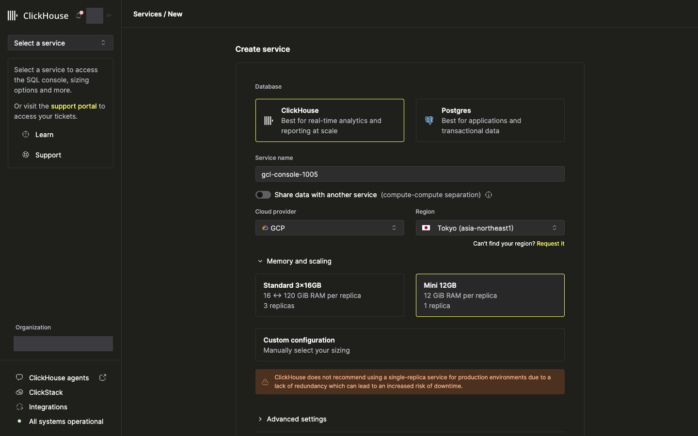

「Create service」を押すと、数分で起動します。
既存のサービスを使う場合は、この手順を飛ばします（26.6 以降）。

## 2. Pub/Sub トピックを作る

Google Cloud Console の Pub/Sub で Topics の「Create topic」を開き、Topic ID を入れます。

- **「Add a default subscription」のチェックを外します。** 既定でオンになっています。ClickPipes は自分の購読を作るので、既定の購読は使われずにメッセージが溜まり続け、料金がかかります。
- 「Enable message retention」はオフのままにします（再処理の元は ClickHouse の L0 に残すため）。

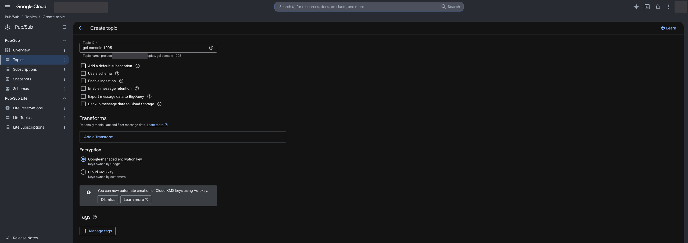

作成したら、トピックの「Edit」を開き、右側の情報パネルの「Storage policy」で、メッセージを保存するリージョンを ClickHouse Cloud のサービスと同じリージョンに限定します。

1. 「Allow in any region」のチェックを外す。
2. 「Add region」で `asia-northeast1` を入れる。
3. 「Enforce in transit」はオフのままにする。
4. パネルの「Update」を押す。

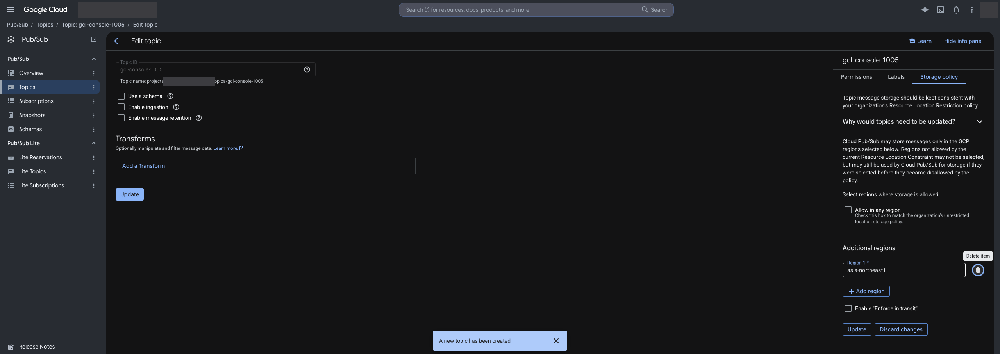

## 3. シンクを作る

Logging の Log router で「Create sink」を開きます。

1. Sink details：シンク名と説明を入れる。
2. Sink destination：「Cloud Pub/Sub topic」を選び、2 のトピックを選ぶ。
3. Choose logs to include in sink：フィルタに `logName:"projects/<project>/logs/"` を入れる（プロジェクトの全ログ）。
4. Choose logs to filter out of sink：量が多く ClickHouse で検索しないノイズがあれば、除外フィルタを入れる（任意）。
5. 「Create sink」を押す。

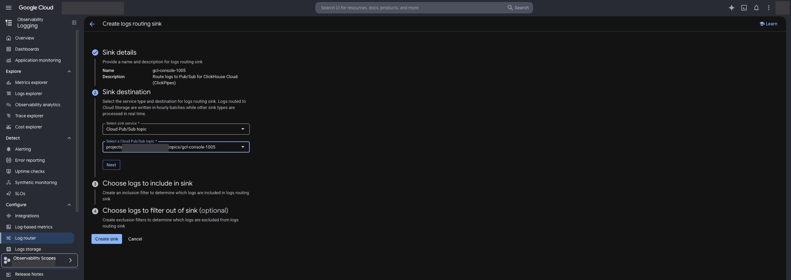

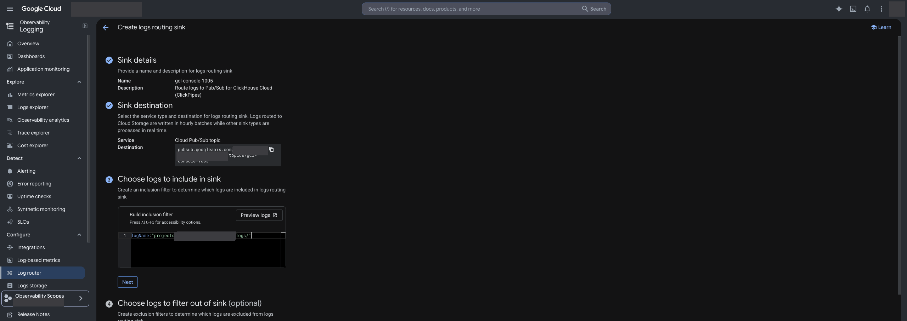

シンクは、作成した時点からプロジェクトの全ログをトピックへ送ります。
シンクは、書き込み用 ID（writer identity）でトピックに公開します。
書き込み用 ID は、Cloud Logging がプロジェクトごとに 1 つ作るサービスアカウントで、同じプロジェクトのシンクで共有されます（`service-<プロジェクト番号>@gcp-sa-logging.iam.gserviceaccount.com` の形。組織やフォルダの集約シンクでは、その組織やフォルダのもの）。
画面でシンクを作り、作った人がトピックのオーナー権限を持っている場合は、Cloud Logging がトピックの公開権限（Pub/Sub Publisher）をこの ID に付けます（[公式資料](https://cloud.google.com/logging/docs/export/configure_export_v2#dest-auth)）。
検証でも自動で付きました。

1. Log router でシンクのメニューから「View sink details」を開き、「Writer identity」を控える。
2. トピックの「Permissions」に、その ID が Pub/Sub Publisher として表示されていることを確かめる。
3. 表示されていなければ（オーナー権限がない、トピックが別のプロジェクトにあるなど）、トピックの「Permissions」から、その ID に Pub/Sub Publisher を付ける。権限を付けるまでの間、シンクは公開に失敗し、その分のログはトピックに届きません。

## 4. ClickPipes 用のカスタムロールを作る

IAM & Admin の Roles で「Create role」を開き、Title、Description、ID を入れます。
「Add permissions」で次の 7 つの権限を追加します（公式の最小権限ロール、[Pub/Sub IAM permissions](https://clickhouse.com/docs/integrations/clickpipes/pubsub/auth)）。

- `pubsub.topics.list`
- `pubsub.topics.get`
- `pubsub.topics.attachSubscription`
- `pubsub.subscriptions.create`
- `pubsub.subscriptions.get`
- `pubsub.subscriptions.delete`
- `pubsub.subscriptions.consume`

権限を選ぶ画面のフィルタは、入れるたびに条件が積み重なります（すべてに一致する条件になる）。
1 つ選んだらフィルタを外してから、次の権限名を入れます。
「Role launch stage」は既定の Alpha のままでも権限は変わりません。

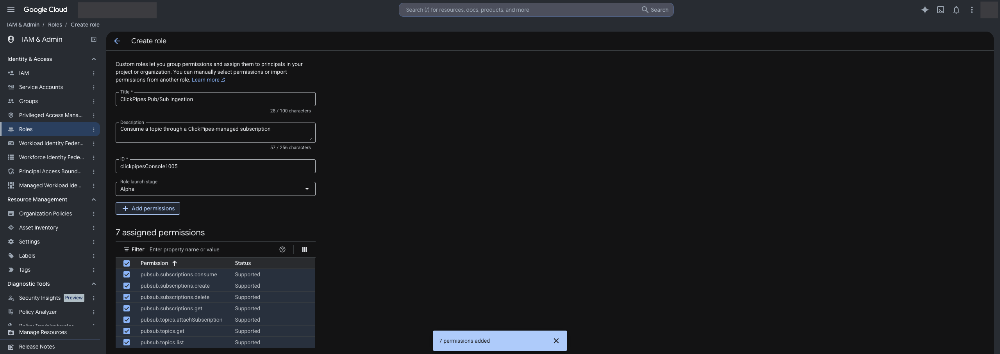

このロールは、プロジェクト内のトピックの一覧と、購読の作成、受信、削除を許します。
範囲が広すぎる場合は、ログの送出専用のプロジェクトにトピックを置きます。

## 5. サービスアカウントを作り、鍵を作る

IAM & Admin の Service accounts で「Create service account」を開き、名前と ID を入れて「Create and continue」を押します。

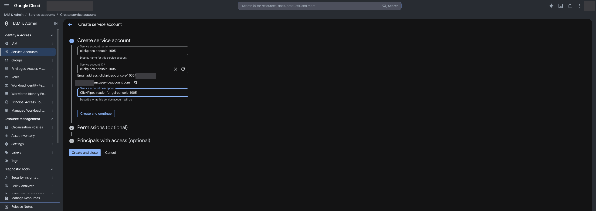

Permissions で、4 のカスタムロールを選び、「Done」を押します。
同じ名前のロールがほかにあると見分けにくいので、説明文か ID（`projects/<project>/roles/<role id>`）で確かめます。

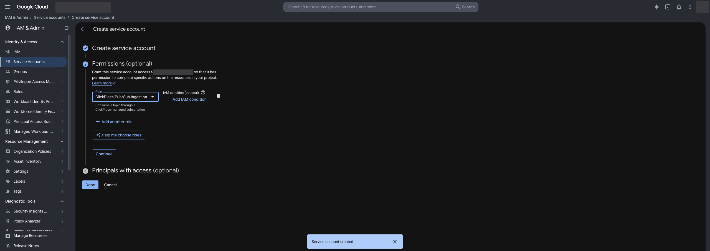

作ったサービスアカウントの「Keys」で「Add key」→「Create new key」→「JSON」→「Create」を押すと、鍵のファイルがダウンロードされます。

- 鍵ファイルはトピックを読むための認証情報です。パスワードと同じように扱い、共有ドライブや Git に置きません。
- ClickPipe に渡した後は、手元のファイルを削除してかまいません。鍵を作り直すときは、同じ画面で新しい鍵を作ります。
- 組織のポリシー（`iam.disableServiceAccountKeyCreation`）で鍵の作成が禁止されている場合は、許可された手順で作った鍵を使います。

## 6. テーブルと MV を作る

ClickHouse Cloud Console でサービスの「SQL console」を開き、新しいクエリに `sql/10_landing_v1.sql`、`sql/20_logs_v1.sql`、`sql/30_logs_v1_mv.sql`、`sql/40_rollup_1m_v1.sql`、`sql/50_noise_rollup_v1.sql` を順に貼ります。
貼る前に、次の文字列を置き換えます。

| 文字列 | 値（Terraform の既定値） |
|---|---|
| `{{LANDING_TTL_DAYS}}` | `7` |
| `{{LOGS_TTL_DAYS}}` | `400` |
| `{{MV_DEFINER}}` | `default` |

「Run」を押すと、すべての文がまとめて実行されます。
エディタが自動で字下げを足しますが、空白だけなので SQL の意味は変わりません。
左の一覧にデータベース `gcl` ができ、テーブル 4 つと MV 3 つが入れば完了です。

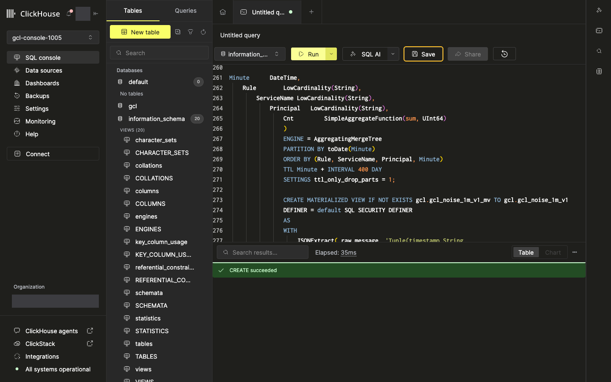

パイプより先に作ります。
パイプは既存の L0（`gcl.gcl_landing_v1`）に書き込み、L1 以降は MV が作ります。

## 7. ClickPipe を作る

サービスの「Data sources」で「Create ClickPipe」を開き、「GCP Pub/Sub」を選びます。
画面には Beta と表示されます（公式資料では Private Preview、[ClickPipes の一覧](https://clickhouse.com/docs/integrations/clickpipes)）。

**Setup your ClickPipe connection**：ClickPipe の名前、GCP Project ID を入れ、5 の鍵ファイルをアップロードします。

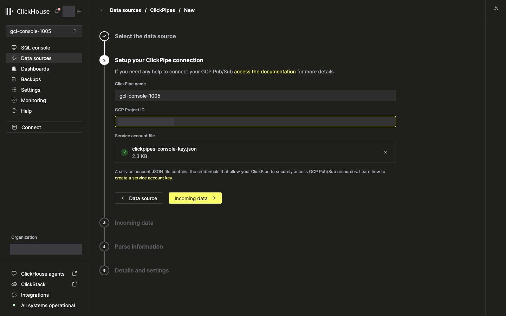

**Incoming data**：

- Pub/Sub topic：2 のトピック
- Data format：JSONEachRow（固定）
- Starting offset：Latest

「Fetch sample data」でトピックのメッセージを読みます。
次の段へ進むには見本が要るので、トピックにまだメッセージがなければ、シンクからログが届くのを数分待ちます。

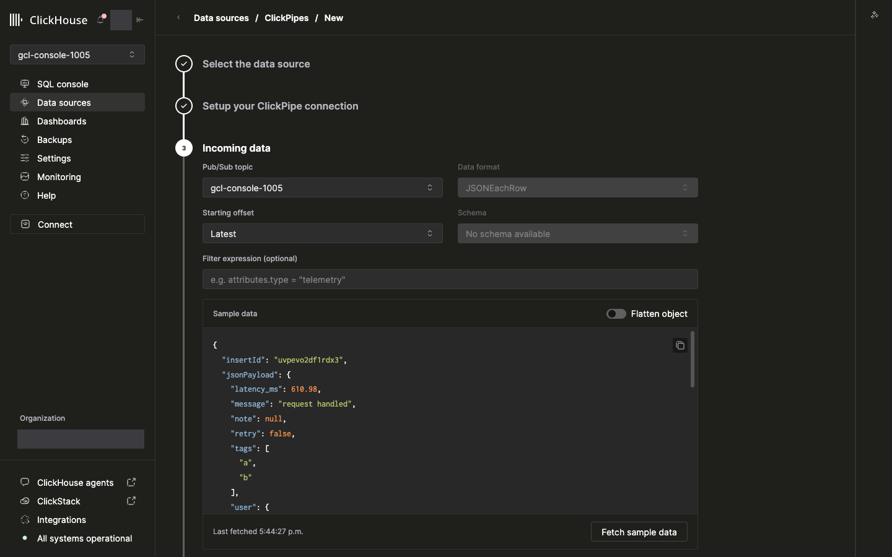

**Parse information**：「Upload data to」で「Existing table」を選び、Database に `gcl`、Table に `gcl_landing_v1` を選びます。
画面が Pub/Sub の仮想列（`_raw_message`、`_message_id`、`_publish_time`、`_attributes`）を、L0 の同じ名前の列へ自動で対応付けます。
JSON の各項目（`insertId` など）は対応付けないままにします。
解析は MV が行うので、L0 には仮想列だけを入れます。

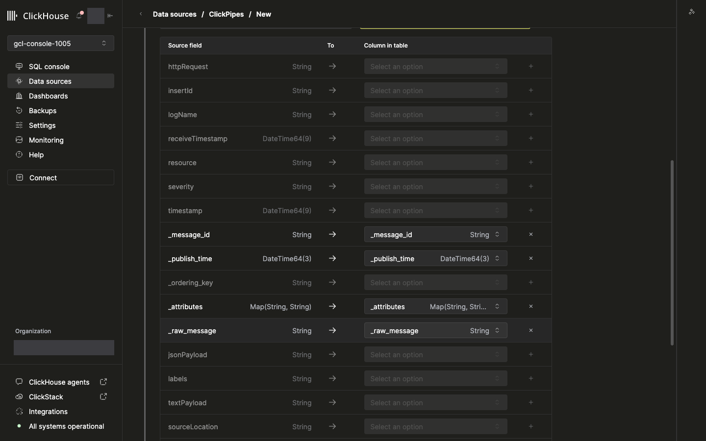

**Details and settings**：Permissions で「Only destination」を選び、「Create ClickPipe」を押します。

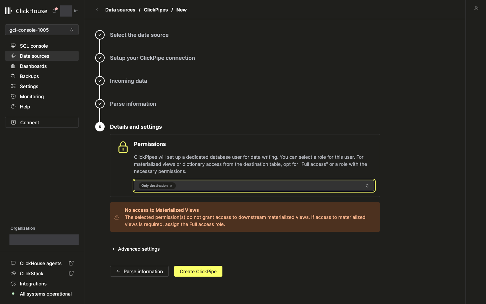

画面に「No access to Materialized Views」という警告が出ますが、この構成では問題ありません。
MV は `SQL SECURITY DEFINER` 付きで、MV の定義者（`default`）の権限で L1 と集計テーブルに書き込むためです。
検証では、パイプのユーザーの権限は L0 とエラーテーブルだけでしたが、L1 と集計テーブルに欠損なく入りました（[検証記録](findings.md) の「ブラウザでの構築」）。

数分で状態が Running になります。
パイプは管理サブスクリプション（`clickpipes-<パイプ ID>`）を作ります（保持 7 日、ack 期限 60 秒、順序付けあり）。

## 8. ClickStack のソースを作る

サービスのメニューから ClickStack を開き、Team Settings の Sources で「Add source」を押します。
Name を入れ、Source Data Type に Log、Database に `gcl`、Table に `gcl_logs_v1` を選びます。
Default Select と、「Configure Optional Fields」で開く項目を次のとおりにします（`terraform/clickstack.tf` と同じ値）。

| 項目 | 値 |
|---|---|
| Timestamp Column | `Timestamp` |
| Default Select | `Timestamp, ServiceName, SeverityText, ResourceType, Body` |
| Service Name Expression | `ServiceName` |
| Log Level Expression | `SeverityText` |
| Body Expression | `Body` |
| Log Attributes Expression | `LogAttributes` |
| Resource Attributes Expression | `ResourceAttributes` |
| Displayed Timestamp Column | `Timestamp` |
| Trace Id Expression | `TraceId` |
| Span Id Expression | `SpanId` |
| Implicit Column Expression | `Body` |
| Use Text Index | Auto（既定） |

「Add Setting」はソースごとのクエリ設定を足す欄で、この構成では使いません。
空の行ができたら、ゴミ箱のボタンで消してから保存します。

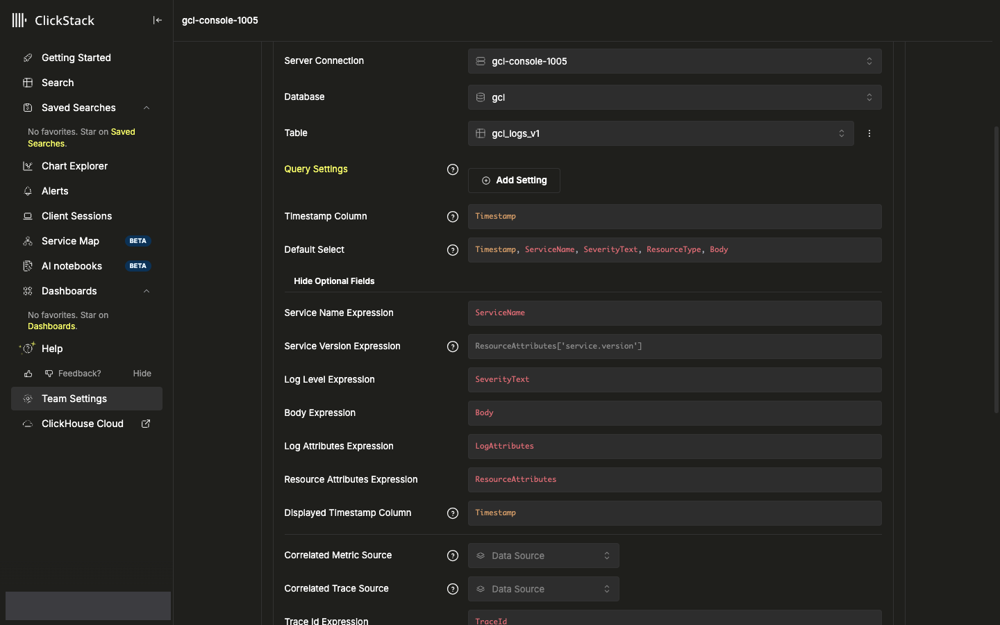

「Save New Source」で保存したら、Search でソースを選び、検索窓に `タイムアウト` などの日本語の語を入れて検索できることを確かめます。

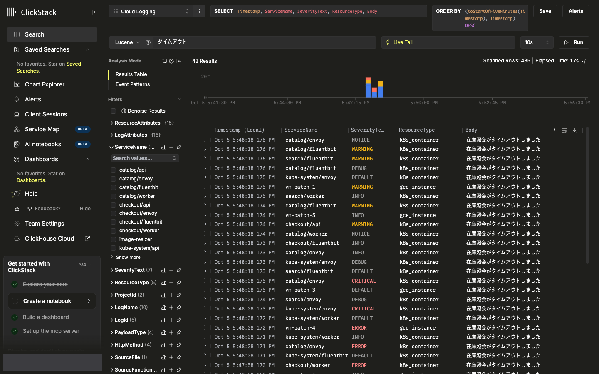

## 9. 動作を確かめる

SQL コンソールで次のクエリを実行し、L0 と L1 に行が入っていることを確かめます。

```sql
SELECT
    (SELECT count() FROM gcl.gcl_landing_v1) AS l0,
    (SELECT count() FROM gcl.gcl_logs_v1) AS l1,
    (SELECT sum(Cnt) FROM gcl.gcl_noise_1m_v1) AS noise;
```

L0 の行数は、L1 とノイズの件数の合計とほぼ一致します（L1 に入る前の数秒分の差はあります）。
定期的な確認は、`verify/checks.sql` の各クエリを SQL コンソールに貼って実行します（[運用](operations.md) の「日常の確認」）。

## 削除する

作った順の逆に削除します。

1. ClickHouse Cloud Console の Data sources で ClickPipe を削除する。
2. Pub/Sub の Subscriptions で、管理サブスクリプション（`clickpipes-<パイプ ID>`）が消えるのを待つ。ClickPipes は、パイプの削除後に 5 のサービスアカウントで購読を消します。購読が消える前に 5 や 4 を削除すると、購読が削除済みのトピック（`_deleted-topic_`）を指したまま残ります（Terraform での検証では、パイプの削除から 23 秒で消えました）。
3. SQL コンソールで `DROP DATABASE IF EXISTS gcl SYNC` を実行する。
4. Log router でシンクを削除する。
5. Pub/Sub でトピックを削除する。
6. IAM でサービスアカウントのロールの付与を外し、Service accounts でサービスアカウントを削除する（鍵も無効になる）。
7. Roles でカスタムロールを削除する。7 日以内なら復元でき、完全に削除されるまで同じ ID では作り直せません。
8. ClickStack の Team Settings の Sources で、8 で作ったソースを削除する。
9. 1 で作ったサービスを使わない場合は、サービスを削除する。
